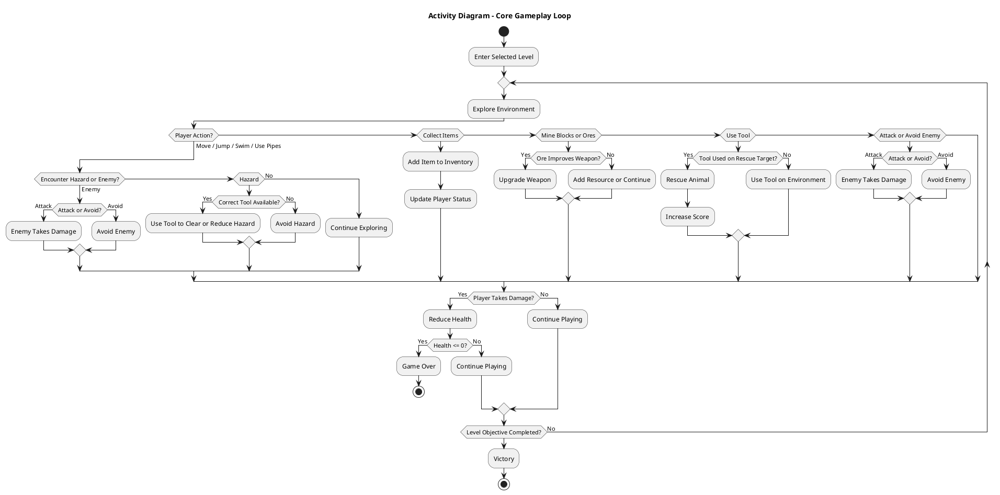

```plantuml
@startuml
title Activity Diagram - Core Gameplay Loop

start

:Enter Selected Level;

repeat
    :Explore Environment;

    if (Player Action?) then (Move / Jump / Swim / Use Pipes)

        if (Encounter Hazard or Enemy?) then (Enemy)

            if (Attack or Avoid?) then (Attack)
                :Enemy Takes Damage;
            else (Avoid)
                :Avoid Enemy;
            endif

        elseif (Hazard)

            if (Correct Tool Available?) then (Yes)
                :Use Tool to Clear or Reduce Hazard;
            else (No)
                :Avoid Hazard;
            endif

        else (No)
            :Continue Exploring;
        endif

    elseif (Collect Items)

        :Add Item to Inventory;
        :Update Player Status;

    elseif (Mine Blocks or Ores)

        if (Ore Improves Weapon?) then (Yes)
            :Upgrade Weapon;
        else (No)
            :Add Resource or Continue;
        endif

    elseif (Use Tool)

        if (Tool Used on Rescue Target?) then (Yes)
            :Rescue Animal;
            :Increase Score;
        else (No)
            :Use Tool on Environment;
        endif

    elseif (Attack or Avoid Enemy)

        if (Attack or Avoid?) then (Attack)
            :Enemy Takes Damage;
        else (Avoid)
            :Avoid Enemy;
        endif

    endif

    if (Player Takes Damage?) then (Yes)
        :Reduce Health;

        if (Health <= 0?) then (Yes)
            :Game Over;
            stop
        else (No)
            :Continue Playing;
        endif

    else (No)
        :Continue Playing;
    endif

repeat while (Level Objective Completed?) is (No)

:Victory;

stop

@enduml
```