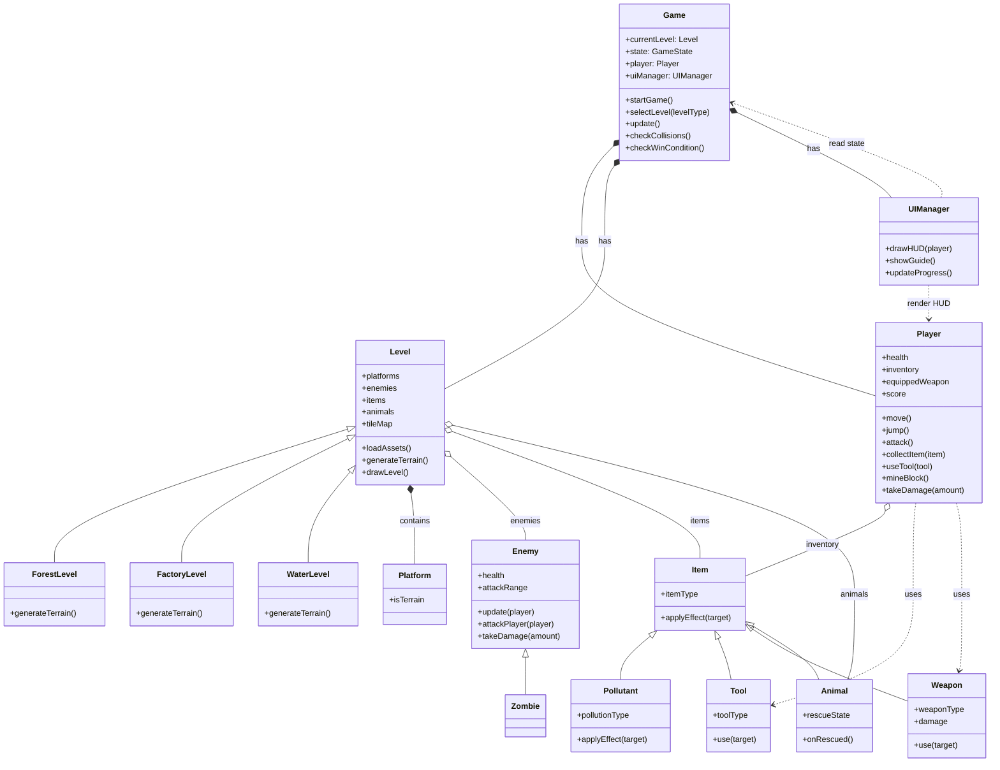

The class diagram shows the high-level structure of *Super Cat and Steve*. The `Game` class acts as the main controller, connecting the current `Level`, the `Player`, and the `UIManager`. The base `Level` class is specialised by `ForestLevel`, `WaterLevel`, and `FactoryLevel`, which allows each world to define its own terrain, enemies, items, animals, and environmental behaviour while keeping the main game loop shared.

The diagram also shows the main gameplay objects around the player. `Player` handles actions such as movement, combat, mining, item collection, and tool use. `Item` is extended by more specific types such as `Tool`, `Pollutant`, and `Weapon`, while `Enemy` and `Animal` represent threats and rescue targets. Overall, the diagram presents the intended object-oriented design without including low-level implementation details.
