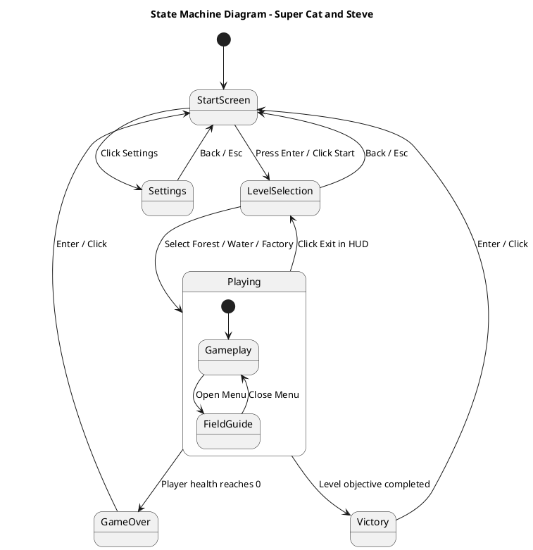

```plantuml
@startuml
title State Machine Diagram - Super Cat and Steve

[*] --> StartScreen

StartScreen --> LevelSelection : Press Enter / Click Start
StartScreen --> Settings : Click Settings

Settings --> StartScreen : Back / Esc

LevelSelection --> Playing : Select Forest / Water / Factory
LevelSelection --> StartScreen : Back / Esc

state Playing {
    [*] --> Gameplay
    Gameplay --> FieldGuide : Open Menu
    FieldGuide --> Gameplay : Close Menu
}

Playing --> LevelSelection : Click Exit in HUD
Playing --> GameOver : Player health reaches 0
Playing --> Victory : Level objective completed

GameOver --> StartScreen : Enter / Click
Victory --> StartScreen : Enter / Click

@enduml
```
