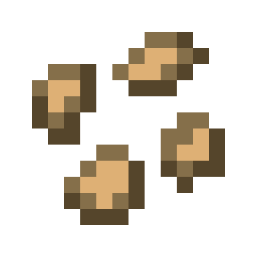
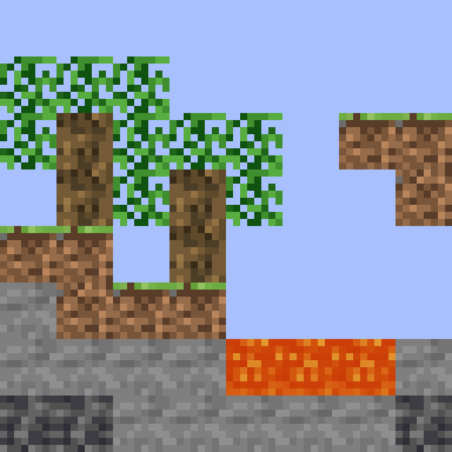
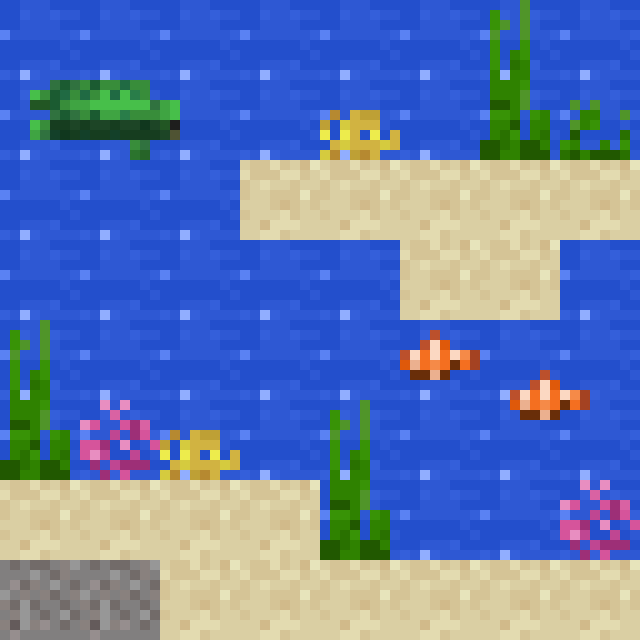
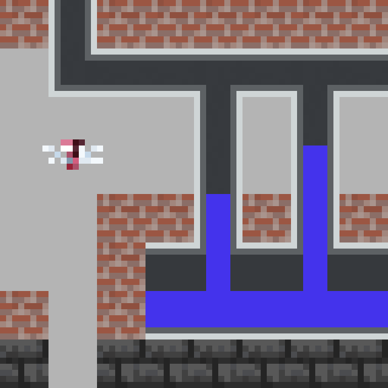
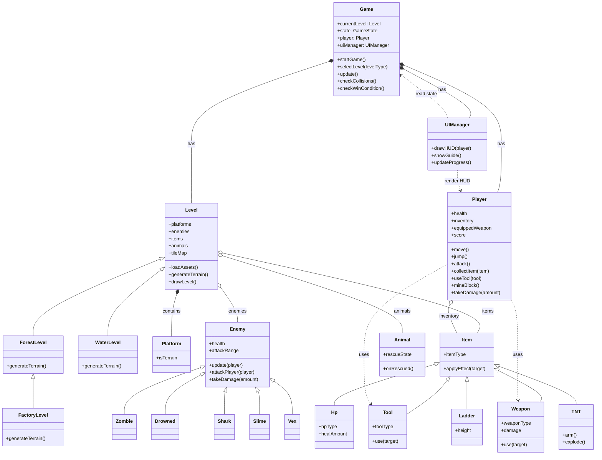
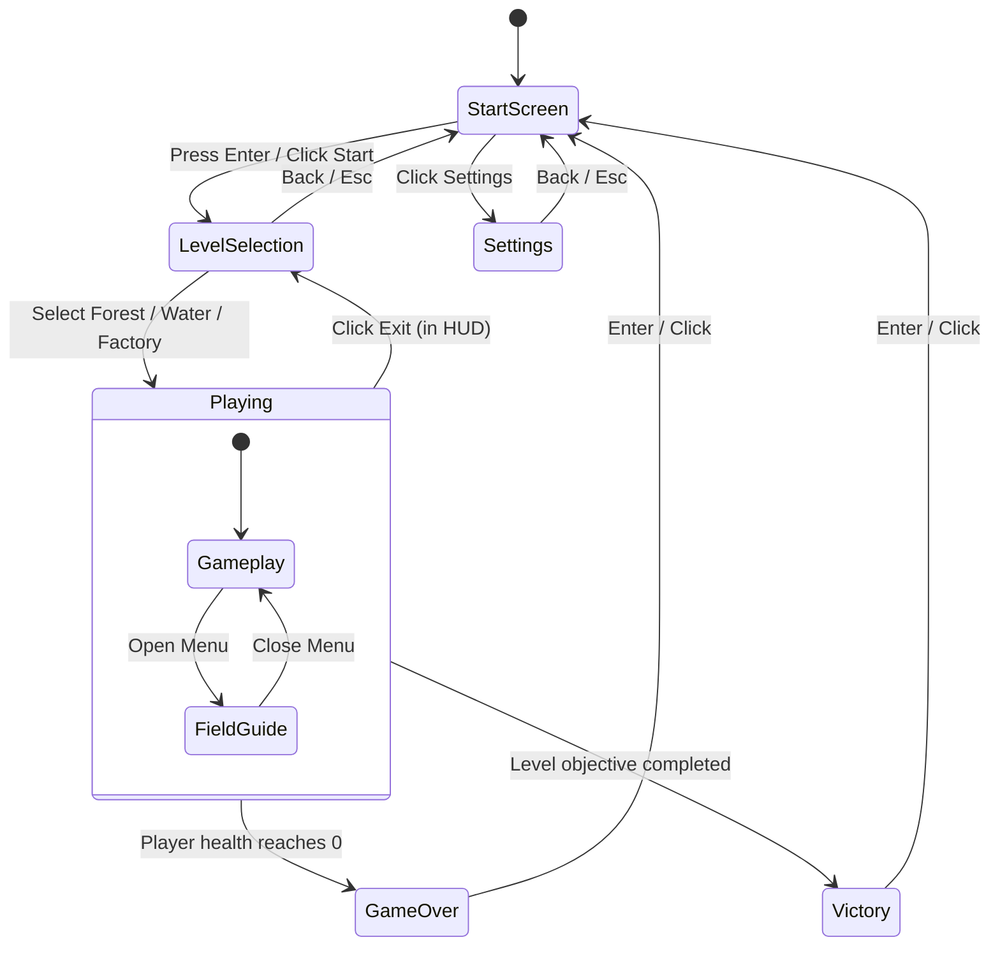
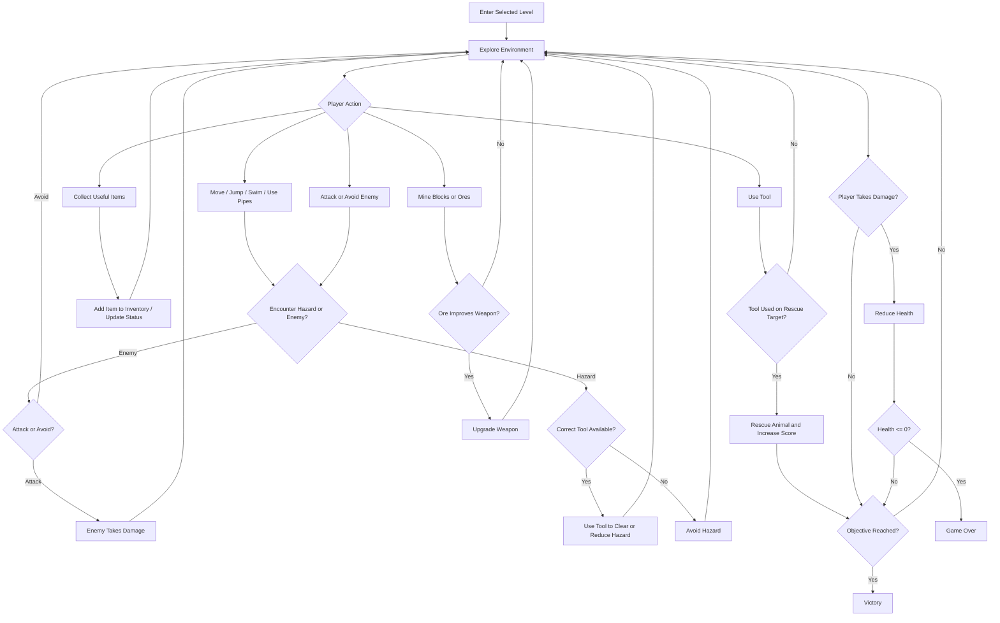

# University of Bristol Software Engineering - Group 15 (2026)

  

  
  &nbsp;&nbsp;
  

---

## Table of Contents
- [1. Weekly Labs](#1-weekly-labs)
- [2. Team](#2-team)
- [3. Introduction](#3-introduction)
  - [3.1 What Makes It Original](#31-what-makes-it-original)
  - [3.2 Brief Intro to the Game](#32-brief-intro-to-the-game)
- [4. Requirements](#4-requirements)
  - [4.1 Early-stage Design and Ideation](#41-early-stage-design-and-ideation)
  - [4.2 Stakeholders](#42-stakeholders)
  - [4.3 Use Case Diagram](#43-use-case-diagram)
  - [4.4 User Stories and Acceptance Criteria](#44-user-stories-and-acceptance-criteria)
  - [4.5 Reflection on the Requirements Process](#45-reflection-on-the-requirements-process)
- [5. Design](#5-design)
  - [5.1 Class Diagram](#51-class-diagram)
  - [5.2 Behavioural Diagram](#52-behavioural-diagram)
  - [5.3 Design Conclusion](#53-design-conclusion)
- [6. Implementation](#6-implementation)
  - [Challenge 1: Force-Based Movement across Land, Water and Pipes](#challenge-1-force-based-movement-across-land-water-and-pipes)
  - [Challenge 2: Hint Cat Following and Obstacle-Aware Feedback](#challenge-2-hint-cat-following-and-obstacle-aware-feedback)
  - [Challenge 3: Enemy Pursuit and Splitting Slime Behaviour](#challenge-3-enemy-pursuit-and-splitting-slime-behaviour)
- [7. Evaluation](#7-evaluation)
  - [7.1 Qualitative Analysis](#71-qualitative-analysis)
  - [7.2 Quantitative Analysis](#72-quantitative-analysis)
  - [7.3 Testing](#73-testing)
- [8. Process](#8-process)
- [9. Sustainability](#9-sustainability)
- [10. Conclusion](#10-conclusion)
- [11. Individual Contribution](#11-individual-contribution)
- [12. AI Statement](#12-ai-statement)

---

## 1. Weekly Labs

| **Week** | **Title** | **Documentation** |
|:--------:|:---------------------------------------------------------|:---------------:|
| 01       | Lab 1: Game Ideas                                        | [README](https://github.com/UoB-COMSM0166/2026-group-15/tree/main/Homework/Homework_Week1_GameIdeas) |
| 02       | Lab 2: Spray Fun and Brainstorm                          | [README](https://github.com/UoB-COMSM0166/2026-group-15/tree/main/Homework/Homework_Week2_SprayFun) |
| 03       | Lab 3: Prototype & Game Selection                        | [README](https://github.com/UoB-COMSM0166/2026-group-15/tree/main/Homework/Homework_Week3_Prototypes) |
| 04       | Lab 4: User Stories & Requirements Engineering           | [README](link_to_readme_04) |
| 05       | Lab 5: Object-Oriented Design & Agile Estimation         | [README](link_to_readme_05) |
| 07       | Lab 7: Think Aloud Study & Heuristic Evaluation          | [README](link_to_readme_07) |
| 08       | Lab 8: HCI Evaluation — NASA-TLX & SUS                   | [README](link_to_readme_08) |
| 09       | Lab 9: Quality Assurance — Black-Box & White-Box Testing | [README](link_to_readme_09) |

---

## 2. Team

  

| **Name**              | **Role**                                                      | **Email**             |
|:----------------------|:--------------------------------------------------------------|:----------------------|
| Helen – Yitong Zheng  | Developer, UI Designer, Level Designer, Video Editor          | ul25116@bristol.ac.uk |
| Li – Li Shen          | Developer, Level Designer, UX Designer, Repository Management | cm25322@bristol.ac.uk |
| Alice – Xianwen Hu    | Developer, UI Designer, UX Designer, Video Editor             | ss25944@bristol.ac.uk |
| Murphy – Jingyu Xiao  | Developer, UX Designer, Level Designer, Audio Designer        | zz25762@bristol.ac.uk |
| Anna – Sirui Zhong    | Developer, UI Designer, Level Designer, Audio Designer        | vc25336@bristol.ac.uk |
| Bella – Linjing Zhang | Developer, UX Designer, Level Designer, Repository Management | sn25366@bristol.ac.uk |

---

## 3. Introduction
**Super Cat and Steve** is a pixel-art platform adventure set across three playable worlds: forest, ocean, and factory.

The player controls Steve through hazards, enemies, tools, rescue targets, and different movement conditions. The core loop is simple to understand: move through the level, stay alive, use the right tool at the right moment, rescue trapped animals, and collect useful recovery or equipment items. The environmental theme is still central, but in the current version it is expressed through animal rescue, hazardous terrain, and tool-based problem solving rather than a rubbish-collection mechanic.

### 3.1 What Makes It Original
*Super Cat and Steve* uses familiar platform-game actions, but each world changes how those actions feel. The forest level focuses on jumping, early rescue tasks, lava treatment, vine growth, and basic combat. The ocean level changes the movement model with buoyancy and drag, adds marine rescue targets, and introduces underwater enemies. The factory level uses pipes, industrial hazards, spikes, and tighter layouts to create a more mechanical setting.

The companion cat also gives the game a clearer identity. It follows the player with a short delay and appears in the HUD as a guide for progress and contextual hints. This makes the game feel less like a plain obstacle course: the player is not only trying to reach the end, but also reading the environment, choosing tools, rescuing animals, and reacting to hazards that belong to each world.

### 3.2 Brief Intro to the Game
#### Characters

<table border="1" cellpadding="12" cellspacing="0">
  <tr>
    <td align="center" width="50%">
        
      <strong>Steve</strong> 
      Steve is the main playable character. The player controls Steve to move through different levels, fight enemies, use tools, rescue wildlife, and survive environmental hazards.
    </td>
    <td align="center" width="50%">
        
      <strong>Cat</strong> 
      The cat is Steve’s companion and an important part of the game’s identity. It helps make the world feel more lively and gives the adventure a more recognisable character.
    </td>
  </tr>
</table>

 

#### Main Tasks

<table border="1" cellpadding="12" cellspacing="0">
  <tr>
    <td align="center" width="20%"><strong>Rescue animals</strong></td>
    <td align="center" width="20%"><strong>Use tools</strong></td>
    <td align="center" width="20%"><strong>Fight enemies</strong></td>
    <td align="center" width="20%"><strong>Mine and explore</strong></td>
    <td align="center" width="20%"><strong>Recover health</strong></td>
  </tr>
  <tr>
    <td align="center">Free trapped animals and help restore the environment.</td>
    <td align="center">Use the correct tool in the correct situation to clear hazards or unlock progress.</td>
    <td align="center">Defeat enemies such as zombies, drowned enemies, sharks, slimes, and vexes while moving through each stage.</td>
    <td align="center">Explore the world, move across different terrain, and mine useful blocks to improve equipment.</td>
    <td align="center">Collect healing items such as apples and golden apples to restore health.</td>
  </tr>
</table>

 

#### Tools and Useful Items

<table border="1" cellpadding="12" cellspacing="0">
  <tr>
    <td align="center" width="16.6%">
        
      <strong>Scissors</strong> 
      Cut traps and nets. Used to rescue birds and fish.
    </td>
    <td align="center" width="16.6%">
        
      <strong>Water Bucket</strong> 
      Used to deal with environmental hazards such as lava.
    </td>
    <td align="center" width="16.6%">
        
      <strong>Limestone</strong> 
      Used to neutralise acid pools.
    </td>
    <td align="center" width="16.6%">
        
      <strong>Vine Seed</strong> 
      Used to grow a climbable vine in the forest level.
    </td>
    <td align="center" width="16.6%">
        
      <strong>Vine</strong> 
      Created after using the vine seed. It works as a ladder and helps the player reach higher platforms.
    </td>
    <td align="center" width="16.6%">
        
      <strong>Wrench</strong> 
      Used to break iron cage and rescue turtles.
    </td>
  </tr>
</table>

 

#### Healing Items

<table border="1" cellpadding="12" cellspacing="0">
  <tr>
    <td align="center" width="50%">
        
      <strong>Apple</strong> 
      A healing item that restores health when collected.
    </td>
    <td align="center" width="50%">
        
      <strong>Golden Apple</strong> 
      A stronger healing item that restores more health than a normal apple.
    </td>
  </tr>
</table>

 

#### Trapped Animals

<table border="1" cellpadding="12" cellspacing="0">
  <tr>
    <td align="center" width="33%">
        
      <strong>Bird</strong> 
      It is caught in a trap and can be freed with scissors.
    </td>
    <td align="center" width="33%">
        
      <strong>Turtle</strong> 
      It is trapped in an iron cage and can be freed with wrenches.
    </td>
    <td align="center" width="33%">
        
      <strong>Fish</strong> 
      It is trapped in a net and can be freed with scissors.
    </td>
  </tr>
</table>

 

#### Enemies and Dangers

<table border="1" cellpadding="12" cellspacing="0">
  <tr>
    <td align="center" width="12.5%">
        
      <strong>Zombie</strong> 
      A ground enemy that can hurt the player and make the player lose health.
    </td>
    <td align="center" width="12.5%">
        
      <strong>Drowned</strong> 
      An underwater enemy that can hurt the player and make the player lose health.
    </td>
    <td align="center" width="12.5%">
        
      <strong>Shark</strong> 
      A marine enemy gliding undersea. It can also hurt player. More dangerous than drowned.
    </td>
    <td align="center" width="12.5%">
        
      <strong>Slime</strong> 
      A sticky and hostile creature that adds variety to enemy encounters.
    </td>
    <td align="center" width="12.5%">
        
      <strong>Vex</strong> 
      A flying enemy type.
    </td>
    <td align="center" width="12.5%">
        
      <strong>Acid Pool</strong> 
      A lethal environmental hazard that must be neutralized by limestone.
    </td>
    <td align="center" width="12.5%">
        
      <strong>Lava</strong> 
      A lethal hazard that can kill the player instantly. It must be treated with buckets of water.
    </td>
    <td align="center" width="12.5%">
        
      <strong>TNT</strong> 
      A dangerous object that the player should avoid. Will not explode instantly.
    </td>
  </tr>
</table>

#### Worlds and Environments

<table border="1" cellpadding="12" cellspacing="0">
  <tr>
    <td align="center" width="33%">
        
      <strong>Forest</strong> 
      The forest world focuses on platforming, rescue, exploration, and early environmental tasks.
    </td>
    <td align="center" width="33%">
        
      <strong>Ocean</strong> 
      The ocean world introduces underwater movement and marine life, with seagrass, coral, kelp, and aquatic enemies.
    </td>
    <td align="center" width="33%">
        
      <strong>Factory</strong> 
      The factory world uses industrial tiles, pipes, and harsher hazards to create a more mechanical and polluted environment.
    </td>
  </tr>
</table>

---

## 4. Requirements
### 4.1 Early-stage Design and Ideation
At the beginning of the project, our team did not decide the final game idea straight away. We first had a brainstorming session where each member suggested possible game types. The ideas we discussed included obstacle-avoidance games such as Snake and Temple Run, matching games like Tetris, level-based platform games inspired by Mario, and battle-style games based on a simplified version of Hearthstone. This gave us several possible directions and helped us compare different types of gameplay before making a decision.

<strong>Game Ideas and Discussion Results</strong>

| Game Type  | Game Prototype   | Game Description  | Added Idea Points  | Possible Challenges  |
|:----------|:----------------|:------------------|:-------------------|:---------------------|
| Platform Adventure / Roguelike / Mystery Gacha | Super Mario (platforming), Risk of Rain (RNG & risk/reward) | Players control Mario through platforming levels, jumping on enemies, collecting coins, and reaching the end flag. | (1) End-Level Box: 50/50 chance each level (Princess = bonuses, Dragon = player gets weaker but survives). (2) Optional Boxes: Random power-ups in dangerous areas. (3) Time Loop: Restart level, player keeps items/coins, loses health. (4) Princess Blessings: Stack blessings for better rewards and higher Princess rates. | (1) RNG fairness & seed control (2) Dynamic health bar & animation (3) Sprite scaling & collision accuracy (4) State persistence for time loop (5) Particle systems (fireworks) (6) Item effect stacking & timers (7) Box placement & level balance (8) Dynamic probability & pity system |
| Single-player / Multi-player / Arcade / Action / Strategy | Bomber Man | Players navigate a maze, placing bombs to destroy obstacles and enemies within a time limit. Each player has 3 lives. | (1) Explosive Block Types - Chain explosions, mini-bombs, unusual fire patterns  (2) Dynamic Maze - Walls move, paths open, blocks regenerate  (3) Enemy AI Variations - Enemies can kick, throw, or push bombs | (1) Fair random maze generation (2) Ensuring dynamic changes don’t disrupt gameplay (3) Balancing different explosion behaviors |
| Multiplayer / MOBA / Action Strategy | Honor of Kings | A 5v5 MOBA focused on team-based combat, hero roles, strategy, and mechanical skill. | (1) Dynamic map events (2) In-match progression choices (3) Team coordination mechanics (4) Improved tutorials & role guidance (5) Post-match performance feedback | (1) Game balance across heroes & items (2) High learning curve for new players (3) Network latency & server stability (4) Matchmaking fairness |
| Macro Management / Multi-tasking / Tower Defense | Command & Conquer: Red Alert | Players build bases, manage resources, research technology, and command land, sea, and air forces to defeat enemies. | (1) Random storyline events (e.g. cold snaps) (2) Dynamic vision & radar systems (3) Destructible terrain & structures (4) Neutral resource competition | (1) RNG balance issues (2) Collision recalculation after terrain change (3) Fixed enemy paths reduce replay difficulty |
| Puzzle Game / Puzzle Adventure | Rusty Lake, Cube Escape, Monument Valley | Puzzle progression driven by observation, rule learning, experimentation, and information synthesis. | (1) Non-linear clue discovery (2) Consistent rules with fair misdirection | (1) Interaction system accuracy (click/drag) (2) Debugging non-linear puzzle states (3) Puzzle logic & save-state management |
| Tower Defense | Kingdom Rush, Plants vs. Zombies | Players place defensive structures to stop waves of enemies from reaching their base. | Add collectible temporary buffs dropped by monsters to increase strategic depth. | Balancing randomness with strategy, avoiding interruption and visual clutter |
| Puzzle Game / Match-3 | Candy Crush Saga | Players swap tiles to match three or more items to meet level objectives within limited moves. | Add obstacles (chocolate, ice, chains) requiring multiple matches to clear. | Ensuring solvable boards & non-repetitive patterns; smooth animations & particle effects |

After careful consideration, we have selected **two game concepts** for further development.

The **first** is a Minecraft-themed 2D platformer. We plan to leverage the iconic pixel art and classic mechanics of Minecraft—such as biome-hopping (from grasslands to deep caves), tool upgrades, and using items like water buckets and TNT—to create a familiar yet fresh exploration and survival experience.

Its major advantages are significantly reduced asset creation by utilizing MC's established visual style and high recognizability among UK audiences. Another key feature of the game is the use of randomly generated enemies, ensuring that each playthrough feels unpredictable. In addition, the game includes multiple environments—such as underground caves, and ocean areas—each with distinct gameplay mechanics and movement constraints.

The **second** is an environmental puzzle game centered on a core "time reversal" mechanic with platforms or maze maps. The player starts in a damaged city and must navigate through it, repair ecological damage, and heal affected wildlife. A character selection system with varied stats (e.g., healing vs. cleanup proficiency) influences multiple endings.

After choosing this direction, we developed the idea into Super Cat and Steve, **an environmental platform game with three themed levels**: forest, ocean, and factory. From this point, our requirements became more specific. The game needed to support basic movement, double jump, combat, item use, mining, score-based level completion, and interactions with environmental hazards. It also needed to include systems for rescuing trapped animals and using tools to deal with hazards, since these actions became central to the final version of the game. According to the current gameplay design, players choose a level at the start, use keyboard controls to move, attack zombies with the F key, use the mouse for tools and mining, and pass the level by gaining enough score through rescue tasks, tool use, and other level objectives.

**The following is a paper prototype of our game:**

### 4.2 Stakeholders
To make our requirements clearer, we used the approach introduced in the requirements workshop. We first identified the stakeholders for the game, then grouped their needs into broader epics, and finally turned these into user stories and acceptance criteria. This was useful because it made us think about the project from different perspectives instead of only from the programmer’s side. In our materials, the stakeholders included not only players but also the development team, artists, testers, publishers, reviewers, teaching staff, and organisations interested in environmental education. This wider view helped us think more carefully about usability, portability, educational purpose, and overall presentation.

The player was still the main stakeholder, so most of our functional requirements were written around the player’s actions. A player should be able to choose a level, move through the environment, avoid or attack enemies, use tools, rescue animals, and complete the level by earning enough points. However, writing these requirements as user stories made them more precise. Instead of saying that the game should be “interesting” or “educational”, we had to describe exactly what the user would do and what the system should return in response. The acceptance criteria were especially helpful because they gave us a simple way to decide whether a feature worked properly or not.

### 4.3 Use Case Diagram
This use case diagram shows the main ways the player interacts with Super Cat and Steve. The player starts the game, selects a level, and then enters the main part of the gameplay, shown here as Explore Level. From this point, the player can carry out several different actions during the level, such as rescuing animals, using tools, fighting enemies, collecting useful items, and mining resources.

We placed Explore Level at the centre of the diagram because it is the core activity of the game. Most of the important gameplay actions happen during exploration, while Complete Level represents the final objective. In our game, finishing a level is closely connected to environmental tasks, especially animal rescue and hazard-solving tasks. For this reason, these actions are shown as key parts of level completion. Overall, the diagram highlights that environmental protection is built into the gameplay itself rather than added only as background theme.

### 4.4 User Stories and Acceptance Criteria
The following user stories were selected from our earlier requirements discussion and refined into a smaller set of core stories. We focused on the stories that were most closely related to the final version of *Super Cat and Steve*, especially its environmental theme, level design, player interaction, and testing needs.

| User Story / Epic | Acceptance Criteria |
| --- | --- |
| **As** a player, **I want** to move through different levels, use tools, and rescue trapped animals, **so that** I can make progress while experiencing the environmental theme of the game. | **Given** the player is in a level, **when** they rescue animals or complete level objectives, **then** their score should increase accordingly. **Given** the player reaches the required score, **when** the level objectives are completed, **then** the player should be able to pass the level. |
| **As** a player, **I want** to use tools in different situations, **so that** I can deal with hazards and complete environmental tasks more effectively. | **Given** the player has collected the correct tool, **when** they use it in the appropriate situation, **then** the related hazard or obstacle should be removed or reduced. **Given** the player uses the wrong tool, **when** the action is triggered, **then** the game should not apply the intended effect. |
| **As** a designer, **I want** each level to represent a different environmental setting, **so that** players can experience a wider range of ecological problems during the game. | **Given** the player enters a new level, **when** the environment changes, **then** the level should show a distinct theme such as forest, ocean, or factory. **Given** the player moves between levels, **when** the new scene loads, **then** the visual style and environmental challenges should clearly differ from the previous one. |
| **As** an artist, **I want** to create modular environmental tiles and assets, **so that** levels can be built efficiently while still looking visually consistent. | **Given** a complete tileset, **when** it is used to build a level, **then** tile edges should connect without obvious gaps. **Given** different themed levels, **when** players view them, **then** the foreground, background, and characters should remain visually clear and easy to distinguish. |
| **As** a player, **I want** a clear resource and status UI, **so that** I can understand my current progress and react quickly during gameplay. | **Given** the game is in progress, **when** the player looks at the interface, **then** the UI should display key information such as score, health, or collected items. **Given** the player’s status changes, **when** the change happens, **then** the UI should update immediately. |
| **As** a tester, **I want** to test the game across different levels and gameplay situations, **so that** I can identify bugs and help improve stability. | **Given** the game includes multiple levels, enemies, and environmental mechanics, **when** a tester plays through them, **then** unexpected behaviour should be recorded and reported clearly. **Given** bugs are found, **when** the development team reviews the reports, **then** the issues should be reproducible and fixable. |
| **As** a professor or teaching assistant, **I want** to review the game design, implementation, and documentation, **so that** I can assess whether the project meets the module requirements. | **Given** the project has been submitted, **when** I review the game and its documentation, **then** I should be able to understand the design decisions, core features, and technical work completed by the team. |

### 4.5 Reflection on the Requirements Process
Through the requirements workshop, our team developed a clearer, more systematic way to capture and structure requirements by first analysing the jogging‑app case study and then applying the same techniques to our own environmental protection game. Starting from the case helped us separate the method (stakeholders → epics → user stories → acceptance criteria) from any specific domain, so we could later reuse it for our game design.

​In the case study, we began by identifying stakeholders such as employees, managers, health services, and transport providers, which showed us how many different parties are affected by a single app. From there we defined epics to describe high‑level goals, then broke these into user stories using the “As a… I want… So that…” template, which forced us to think concretely about each stakeholder’s needs and benefits.

We then wrote acceptance criteria in the Given–When–Then format to turn those stories into testable, unambiguous conditions, clarifying what “done” means for each requirement. After this, we transferred the same process to our environmental protection game by identifying our own stakeholders (players, environmental agencies, developers, etc.), grouping their goals into epics, and expressing concrete user stories and acceptance criteria for gameplay, learning outcomes, and technical behaviour.

​Applying these techniques to our game solidified the connection between requirements and the product's core context. It helped us align technical tasks (e.g., efficient asset loading) with business goals (portability) and user values (environmental education), ensuring that every feature we plan serves a clear purpose for both the project and its users.

Looking back, the requirements stage was not just an early planning task. It played an important role in shaping the whole project. It helped us choose an idea that matched both our interests and our technical ability, and it also gave us a clearer structure for development. Without that stage, the game would probably have remained a general “environmental game” idea rather than becoming a more focused platform adventure with clear goals and mechanics.

---

## 5. Design

  

### 5.1 Class Diagram
The design uses `Game` as the central controller. It stores the current state, creates the selected level, updates the player and level objects each frame, checks collisions, and switches to game-over or victory when the relevant condition is met. The three playable worlds are represented as level classes: `ForestLevel`, `WaterLevel`, and `FactoryLevel`. They share the same base structure but define different terrain, items, enemies, animals, and hazards.

The object model separates moving entities from collectable or interactive items. The `Player` is responsible for movement, jumping or swimming, attacking, mining, taking damage, collecting inventory items, and using tools. Enemies such as zombies, drowned enemies, sharks, slimes, and vexes reuse a shared enemy structure, while rescue targets and barriers are handled through animal, cage, and net objects. The diagram therefore records the main code organisation without treating unfinished direct-cleanup mechanics as final gameplay features.

### 5.2 Behavioural Diagram
#### 5.2.1 State Machine Diagram
The state machine reflects the screens that exist in the game code. The player begins at the start screen, moves to level selection, chooses one of the three worlds, and then enters the playing state. From there, the game can return to level selection through the HUD exit button, enter a settings or guide-related state, or move to game over or victory based on health and objective progress.

#### 5.2.2 Activity Diagram: Core Gameplay Loop
The activity diagram shows the repeated decisions inside a level. The player explores, moves through the current environment, picks up useful items, mines blocks, uses tools, attacks enemies, avoids hazards, and rescues animals. These actions update the inventory, health, score, and progress bar until the player either completes the level objective or loses all health.

### 5.3 Design Conclusion
The design work was useful because it forced us to separate the game into parts that could be built and tested independently. `Game` controls the main loop and state changes, the level classes define world-specific content, and the entity and item classes handle behaviour that appears repeatedly across the forest, ocean, and factory. This structure made it easier for different team members to work on levels, UI, enemies, tools, and movement without rewriting the same logic in several places.

The final implementation also shows where our design changed during development. The earlier direct-cleanup objective was removed from the final gameplay, so the design now focuses on mechanics that are actually visible in the current game: rescuing animals, using tools on hazards or barriers, mining blocks and ores, collecting health items, fighting enemies, and surviving different movement conditions. This makes the report more consistent with the uploaded code and with what players can experience in the playable version.

A remaining design risk is that many features still meet inside the same update loop. Adding more enemies, tools, or level-specific hazards could make the code harder to maintain if new behaviours are added directly into large condition blocks. A future version should continue moving shared behaviour into parent classes or helper functions, while keeping level-specific rules inside the relevant level class. That would let the game grow without making the core loop harder to understand.

---

## 6. Implementation
When we started building our game, we quickly realised most time went into three linked areas: getting the movement loop to feel right across different environments, making the hint cat feedback work clearly both in the world and in the UI, and building enemies that behave actively without feeling unfair. These sounded like three clear technical goals, but they turned into many prototypes, small fixes, and repeated tuning of the same core systems.

### Challenge 1: Force-Based Movement across Land, Water and Pipes
Our original plan for movement was standard platformer jumps on land, slower motion in water, and a clear “being pushed” feeling in pipes. The tricky part was doing this without three separate controllers, because that would be hard to maintain and even harder to tune.

We kept one movement loop based on velocity plus environment-specific forces. On land, the player receives an upward impulse when jumping and gravity pulling them down, but we used lighter gravity while going up and heavier gravity while falling. This gave better jump control while keeping a clear sense of weight when landing.

  

>**Land – jumping behaviour :**
>A short clip showing the player’s jump on solid ground, with lighter upward motion and a heavier fall to keep the character feeling responsive but grounded.

Water exposed problems immediately. Simply lowering gravity slowed the drop but still felt like moving through air. We added upward buoyancy to counter part of gravity, and horizontal drag to reduce speed. The underlying “velocity plus forces” update loop stayed the same, but the very different values are what gave the ocean levels their distinct feel.

  

>**Underwater movement – buoyancy and drift :**
>The player moving underwater, gently rising or sinking when no input is given, illustrating the balance between gravity, buoyancy and drag.

Pipes were different again: the player is mostly carried by a flow force, with friction to prevent endless acceleration. Getting the balance right took several rounds of playtesting: if the flow was too weak it had almost no impact, and if it was too strong it became very hard to control. The final version still felt powerful, but gave players enough time to react to hazards.

  

>**Pipes – flow‑driven movement :**
>The player travelling through a pipe section, being carried forward by the water flow while still having enough control to react to obstacles.

The real difficulty was the interaction between environments. A change that improved jumping in the forest could easily break water exits or make pipes almost unplayable. To keep this manageable, we separated shared update logic from per-environment configuration data, so tuning usually meant adjusting numbers rather than rewriting movement code.

This force-based system also drove enemies and items, with their own parameter sets. Water creatures combined the same forces with small sinusoidal offsets so that they looked like they were swimming rather than sliding. Collisions snapped entities back to boundaries and cleared the corresponding velocity components, which kept behaviour consistent without needing a full physics engine.

### Challenge 2: Hint Cat Following and Obstacle-Aware Feedback
The hint cat needed believable following and feedback about nearby hazards, tools and trapped animals. Early versions became unreliable on moving platforms and in more vertical sections, so for a while we removed the physical follower, even though we still liked the idea of a companion character linked to the environmental theme.

The core technical problem was how to avoid snapping the cat directly to the player every frame. Our solution was to record the player’s bottom-centre position over time in the update loop and store it in a small trace buffer. The in-world cat then reads a slightly delayed position from that buffer (around half a second behind), and flips its sprite based on the movement direction. This creates a stable trailing motion without needing a separate movement or pathfinding system.

Obstacle handling reuses the same collision queries and terrain height checks as the player. The cat’s position is derived from world coordinates and ground height, so it automatically stays on walkable surfaces and respects platforms and walls, instead of needing its own physics controller.

  

>**Hint cat – delayed follow and HUD feedback :**
>The hint cat trailing slightly behind the player in the level while a matching cat icon and short messages appear on the progress bar in the HUD.

We then connected this follower to the feedback systems in the HUD. The game already tracks level progress in the update loop, so we reused that value to drive both the top progress bar and a cat icon that moves along it. The displayed progress interpolates towards the maximum distance reached, which keeps the bar and icon smooth and consistent with the player’s movement. At the same time, the hint system uses the same UI cat as an anchor for short context-sensitive messages when the player rescues animals, rescues animals or encounters hazards. In other words, the player sees the same hint character in two forms: as a delayed follower in the world, and as a cat icon on the progress bar that anchors messages about hazards, tools and objectives.

### Challenge 3: Enemy Pursuit and Splitting Slime Behaviour
The enemy system focused on active pursuit and the splitting behaviour of the slime, so that enemies felt proactive rather than static.

A shared update loop handled detection, movement and damage. When the player attacks, the game scans for enemies within a configurable range, filters them by relative position and collision boxes, and applies damage to the closest valid target. Contact damage works in the opposite direction: instead of dealing damage in a single instant, the game accumulates overlap time and converts it into damage per second. This is easier to tune than writing separate one-off rules for each enemy type.

The slime added extra complexity. After taking enough damage, it splits into several smaller slimes instead of disappearing. Each child slime is spawned with its own position, collision box and an initial “splash” velocity so that the fragments spread out rather than stacking on one spot. These new slimes are immediately added to the main enemy update loop, so they inherit the same movement, pursuit and damage behaviour as any other enemy. Removing the parent while adding the children in the same frame required careful handling to avoid glitches in collision and damage checks.

  

>**Slime – splitting on damage :**
>A slime enemy taking damage, breaking apart into several smaller slimes that immediately continue to move and attack.

For pursuit behaviour, we kept the logic straightforward. Chasing enemies compute their horizontal direction from the player’s position and move towards them whenever the player is within range. Vertical movement is heavily damped, especially in water or uneven terrain, so enemies do not instantly jump to the player’s height. Collision separation reuses the same approach as the player: when enemies overlap, the system pushes them apart along the least disruptive axis and clears the corresponding velocity component. This keeps close encounters stable, even when several enemies are active at once.

  

>**Enemies – active pursuit :**
>Enemies detecting the player and moving towards them, demonstrating the pursuit logic and collision handling used in the enemy system.

By keeping everything inside a single update loop and reusing the same collision and damage systems, we could support both simple chasers and more complex enemies like the splitting slime without introducing separate subsystems for each one.

---

## 7. Evaluation
### 7.1 Qualitative Analysis
To evaluate the usability and overall experience of our game, we used a qualitative approach that combined a **Think Aloud evaluation** with a **heuristic analysis** based on Nielsen’s usability guidelines. These methods helped us understand how players actually played the game, where they became confused, and which usability issues should be prioritised in later iterations.

#### 7.1.1 Think Aloud Evaluation
We conducted a **Think Aloud evaluation** on the **first forest level** and the **partially implemented second ocean level** to identify usability issues during gameplay.

**Key Findings**

- **Guidance and information**
  - Grey hint boxes were often overlooked until players were stuck, which suggests that their visibility is not sufficient, especially for younger players.

- **Combat and controls**
  - Enemies showed little reaction when hit and there were no clear health indicators, so players could not easily tell whether their attacks were successful or how many hits were required.
  - Some players instinctively tried **Left Click** to attack and mentioned that the attack animation did not match the actual hit range.

- **Items and environment behaviour**
  - Some tools stayed in the inventory after use while others disappeared, leaving players unsure whether tools were meant to be reusable or single‑use.
  - Lava could only be cleaned from one side, forcing players to backtrack, and cleaned acid pools looked unchanged, so it was hard to see whether an area was finished.

- **Movement and interface**
  - Rock collision boxes felt too large, making some jumps effectively impossible because of invisible boundaries.
  - Inventory slots were narrow, which made it difficult to collect and quickly review all tools and useful items.

#### 7.1.2 Heuristic Analysis
**Method**

To complement the Think Aloud evaluation, we conducted a heuristic analysis of the same two levels. The main issues identified in the Think Aloud sessions were mapped to Nielsen’s usability heuristics and rated on **frequency**, **impact**, and **persistence** on a 0–4 scale. A **severity score** was then calculated as the average of these three values to help us prioritise the issues more systematically in later iterations.

**Issues and Severity**

| **Interface**    | **Issue**                                                                                                 | **Heuristic(s)**                                             | **Frequency (0–4)** | **Impact (0–4)** | **Persistence (0–4)** | **Severity** |
|:----------------:|-----------------------------------------------------------------------------------------------------------|:-------------------------------------------------------------|:-------------------:|:----------------:|:---------------------:|:-----------:|
| Hints            | Grey hint boxes are easy to miss; players often only notice hints after getting stuck.                    | H1 – Visibility of system status; H10 – Help & documentation |         3           |        4         |           3           |   **3.3**   |
| Combat           | Enemies show weak hit feedback and there are no clear health indicators.                                  | H1 – Visibility of system status; H5 – Error prevention      |         3           |        4         |           3           |   **3.3**   |
| Combat / Controls| Attack controls and hitboxes are unclear; some players try Left Click and feel the hit range is inconsistent. | H2 – Match between system and real world; H4 – Consistency & standards |         2           |        3         |           3           |   **2.7**   |
| Inventory        | Tool behaviour is inconsistent; some tools disappear after use while others remain.                       | H4 – Consistency & standards; H6 – Recognition rather than recall |         2           |        3         |           2           |   **2.3**   |
| Environment      | Cleaning lava/acid does not always give clear visual feedback; acid pools look unchanged when cleaned.    | H1 – Visibility of system status; H5 – Error prevention      |         2           |        3         |           2           |   **2.3**   |
| Movement         | Rock collision boxes feel larger than sprites, making some jumps effectively impossible.                  | H2 – Match between system and real world; H8 – Aesthetic & minimalist design |         2           |        4         |           2           |   **2.7**   |
| UI / Inventory   | Inventory layout is narrow, making it hard to see and manage all tools and useful items.                    | H8 – Aesthetic & minimalist design; H6 – Recognition rather than recall |         1           |        2         |           2           |   **1.7**   |

> Severity = (Frequency + Impact + Persistence) / 3

**Interpretation**

The heuristic analysis reflects and structures the issues observed in the Think Aloud evaluation:

- **Guidance and information** – Issue 1 confirms that hint visibility is too low, matching player reports that they only noticed grey hint boxes after getting stuck.
- **Combat and controls** – Issues 2 and 3 relate to weak combat feedback and unclear attack controls, consistent with players not knowing whether hits were registered or which input to use.
- **Items and environment behaviour** – Issues 4 and 5 capture inconsistent tool behaviour and unclear environmental changes, making it harder for players to understand how cleaning mechanics work and when an area is complete.
- **Movement and interface** – Issues 6 and 7 align with feedback about oversized collision boxes and a cramped inventory, which affects both movement fairness and the readability of collected items.

#### 7.1.3 Follow-up Changes
In later iterations, we increased hint visibility, improved combat feedback and hitbox alignment, made tool and environment behaviour more consistent, and adjusted collision boxes and the inventory layout to make the game easier to play and understand.

---

### 7.2 Quantitative Analysis
We conducted a structured usability and workload evaluation with **10 participants**. Each participant played the game at two difficulty levels: **Level 1 (Easy)** and **Level 2 (Hard)**.

#### 7.2.1 Method
- **System Usability Scale (SUS):** 10‑item questionnaire to measure perceived usability.
- **NASA Task Load Index (NASA‑TLX):** Six subscales to assess mental and physical workload.
- **Statistical test:** Wilcoxon signed‑rank test (paired, two‑tailed, $\alpha = 0.05$).

#### 7.2.2 Data Summary and Statistical Results

  

  

  

> Raw SUS and NASA‑TLX scores for both difficulty levels are shown in the figures above.

**Summary**

| Metric         | Level 1 Mean (SD) | Level 2 Mean (SD) | Wilcoxon Statistic | P‑value   | Significant? |
| :------------: | :---------------: | :---------------: | :----------------: | :-------: | :----------: |
| **SUS score**  | 86.0              | 55.0              | $W = 0$            | $p < 0.01$| **Yes**      |
| **NASA‑TLX**   | 27.6              | 21.9              | $W = 8.5$          | $p > 0.05$| **No**       |

#### 7.2.3 Key Findings
**System Usability Scale (SUS)**

The SUS score decreased from **86.0** (Grade A – excellent usability) at Level 1 to **55.0** (Grade F – poor usability) at Level 2, and this difference was statistically significant ($p < 0.01$).

- **Interpretation:** As difficulty increases, players perceive the game as noticeably less usable. This suggests that elements of the mechanics or interface in the Hard mode reduce the sense of control or clarity, and should be reviewed in future iterations.

**NASA Task Load Index (NASA‑TLX)**

NASA‑TLX scores did **not** show a statistically significant difference between Level 1 and Level 2 ($p > 0.05$).

- **Interpretation:** Although players rated the Hard mode as less usable in SUS, their overall perceived workload (mental and physical effort) remained at a similar level. This may be influenced by the small effective sample size (ties reduced the number of usable pairs to $n = 6$) and by players reaching a stable effort level early in the task rather than increasing effort further in the Hard condition.

#### 7.2.4 Follow‑up Changes
The numbers suggested that our Hard mode had more of a usability issue than a workload issue. SUS scores dropped from 86.0 (Grade A) to 55.0 (Grade F) with a clear effect (W = 0, p < 0.01), while NASA‑TLX scores stayed at a similar level and did not show a significant difference (27.6 vs 21.9, W = 8.5, p > 0.05, effective n = 6).

We read this as players not necessarily working harder in the Hard mode, but feeling that it was **less clear and less under their control**. In response, we did not simply make the level easier. Instead, we adjusted enemy placement, jump distances and rock collision boxes so that jumps which looked possible were actually possible in the physics, and we tweaked some hazard timings to avoid “I couldn’t see that coming” moments.

We also improved feedback in the interface by making hit reactions, health changes and tool behaviour easier to read. The goal was to keep the challenge, but reduce frustration caused by unclear situations rather than by genuine difficulty.

---

### 7.3 Testing

#### 7.3.1 Black-Box Testing
We used black-box testing to evaluate whether the main gameplay features behaved as expected from the player’s point of view, without focusing on the internal code structure. The tests covered core interactions such as movement, digging, combat, item collection, rescue actions, damage, death conditions, UI buttons, and map boundaries. This helped us check whether the visible behaviour of the game matched the intended design and whether key mechanics were understandable and reliable during play.

| Test Group | Precondition | Test Steps | Expected Result |
|:---:|---|---|---|
| Start game | The game has been loaded successfully. | Press **Enter** on the start screen. | The game enters the level selection screen. |
| Level select | The player is on the level selection screen. | Press **1**, **2**, or **3**. | The selected level starts and the game enters playing state. |
| Move | None. | Press **A**. | The player moves to the left. |
| Move | None. | Press **D**. | The player moves to the right. |
| Move | The player is on the ground. | Press **W**. | The player jumps upward. |
| Move | The player is in water. | Hold **W**. | The player rises upward in water. |
| Move | The player is in water or in a level section where downward movement is possible. | Press **S**. | The player moves downward or performs the downward movement action correctly. |
| Dig | The player is close to a terrain tile and keeps the mouse pressed long enough. | Long press on the tile. | The tile disappears. |
| Dig | The player is close to an ore tile such as iron ore and keeps the mouse pressed long enough. | Long press on the tile. | The tile disappears, and the weapon is upgraded if the mined ore gives a stronger sword. |
| Attack | The player is close enough to an enemy. | Press **F** repeatedly. | The enemy takes damage and disappears after enough successful attacks. |
| Save | The player is close to the scissors and also close enough to a trapped bird. | Collect the scissors, select them in the inventory, and use them near the bird. | The scissors are consumed, the bird is rescued, and the score increases. |
| Collect | The player is close to a collectible item. | Move to the item. | The item is collected and added to the inventory if it is a tool or useful item. |
| Heal | The player is close to an apple. | Touch the apple. | The player gains health. |
| Heal | The player is close to a golden apple. | Touch the golden apple. | The player gains more health than from a normal apple. |
| Die | The player falls into lava or acid. | Step into the hazard. | The player dies and the game enters the game-over state. |
| Die | The player steps on TNT. | Touch the TNT and wait for the explosion. | The TNT is triggered and the player dies if caught in the blast. |
| Die | The player remains in contact with an enemy until health is depleted. | Stay near the enemy for repeated damage. | The player’s health reaches zero and the game enters the game-over state. |
| Quit during playing | The game is in playing state. | Click the exit button. | The game returns to the start page. |
| Menu during playing | The game is in playing state. | Click the menu button. | The field guide / menu opens and shows the animals, tools, useful items, or hazards for the current game. |
| Boundary | The player is in the water level and continues rising upward. | Hold **W** long enough to reach the upper boundary. | The player can move out of the visible canvas temporarily; when upward input stops, the player falls or sinks back down. |
| Boundary | The player reaches the lower death boundary or falls into a lethal lower hazard. | Move downward until reaching the lower fatal area. | The player dies and the game enters the game-over state. |
| Restart after fail | The game is in the game-over state. | Press **Enter**. | The game returns to the start screen. |
| Restart after victory | The game is in the victory state. | Press **Enter**. | The game returns to the start screen. |

#### 7.3.2 White-Box Testing
In this project, we used white-box testing to test internal game logic. To make this easier to use, we built a browser-based test runner page to show the test result more directly. Our white-box tests focus on stable internal logic, such as collision checks, player state updates, inventory limits, camera boundaries, hint-cat follow logic, and simple collision state changes.

| Test ID | Function / Area | Internal Logic Tested | Expected Result | Result |
|---|---|---|---|---|
| 01 | `rectCollision` | Overlap and edge-touch logic | Overlap returns true; edge-touch returns false | Pass |
| 02 | `Player.collect` | Basic item collection into inventory | Item is added to inventory | Pass |
| 03 | Inventory limit | Inventory upper bound under repeated collection | Inventory size stops at slot limit | Pass |
| 04 | `Player.takeDamage` | Health lower-bound clamp | Health does not go below 0 | Pass |
| 05 | `Player.jump` | First jump + second jump boost | Second jump uses stronger upward force | Pass |
| 06 | `Game.updateCamera` | Left clamp, middle follow, right clamp | Camera stays within valid world range | Pass |
| 07 | `HintCat.follow` | Relative follow position to player state | Cat follows to left and keeps bottom alignment | Pass |
| 08 | `Game.checkCollisions` | Enemy contact damage + item pickup state changes | Health decreases and colliding item is collected | Pass |

---

## 8. Process
From the beginning, we treated our game as a shared design project rather than just a piece of coursework. We did not appoint a formal team leader. Instead, we worked with shared ownership of the game concept and environmental theme, while each member still had a main area they focused on, such as programming, level design, UI/UX, art, audio, or evaluation. In discussions we were less interested in "who owns this file?" and more interested in questions like "what does this change mean for the player?" and "does it support our environmental education goal for children?".

### 8.1 How We Organised Our Work
A practical question we asked ourselves early on was how to organise work so that we could keep moving, but still react to new ideas and feedback. We ended up following a light-weight **Agile** approach based on short iterations, regular discussion, and continuous adjustment rather than a fixed plan from the start. Most weeks, we held a team meeting of around one hour, usually before or after the workshop, to review progress and agree on the next priorities. These meetings were used to report what had already been completed, identify the main focus for the coming week (for example, connect rescue actions and hazard interactions to the scoring system, make the forest level playable end-to-end, or finalise enemies and rescue targets for the ocean level), refine game details, and discuss any problems that had come up during development. Our aim was always to keep a version of the game in a playable state, even if some assets or UI elements were still temporary, because this made it easier to see whether something was fun or confusing instead of debating it only at the design level.

Outside the weekly meetings, we relied on quick communication through a group chat. Smaller issues, such as UI placement, wording, minor gameplay adjustments, or bug updates, were usually discussed there or through one-to-one messages, which was much more efficient than waiting for the next full meeting. This gave us a balance between structured weekly planning and day-to-day flexibility.

For task tracking and collaboration, we mainly used the **GitHub kanban board** to assign work and monitor progress. Features, bugs, and design tasks were broken down into smaller cards and moved through the board as development continued. We also used GitHub branches and pull requests to manage code changes so that the main branch stayed stable enough for testing. In terms of development tools, **Visual Studio Code** was our main coding environment. For sprite and tile creation, we used **Pixelorama** and **Piskel**, and for diagrams such as use‑case and planning visuals, we used **draw.io**. Keeping the project within a small and consistent set of tools made collaboration much easier, especially when one member needed to step into another person’s work.

### 8.2 How Workshops and Discussion Shaped the Game
The **workshops** this semester had a clear influence on how we thought about the game. Instead of treating Agile, requirements, evaluation and testing as separate topics, we tried to mix them into our normal workflow. The Agile sessions reminded us to keep the work in small steps, get something running early, and review it often. The requirements activities (stakeholders, user stories, acceptance criteria) helped us turn rough ideas into clearer expectations for the game. They made us spell out who we were designing for, what those players should be able to do, and what “done” should look like. This also made it easier to see how small tasks, like adding a tool or changing a level, linked back to the overall goal of making an environmental game that children can understand and play. Later, the evaluation workshops gave us a way to check whether we were actually meeting those expectations. We used Think Aloud, heuristic evaluation, SUS and NASA‑TLX not just to collect numbers, but to see which parts of the game worked well and which parts confused or frustrated players. The feedback led to concrete changes, for example to hint visibility, combat feedback, movement and the inventory layout, so that the game better matched what players needed. Altogether, this helped us turn a loose “environmental game” idea into a version of Super Cat and Steve that we could actually build, test and iterate on.

On top of this, a recurring question in our own meetings was how to make the game **meaningful as an environmental game for younger players**, rather than just another platformer with a theme attached. We often asked how to make the game both educational and enjoyable: how to design more interesting levels, suitable enemies and animals, clearer environmental tasks, and a more user‑friendly interface. These conversations directly shaped the structure of the game.

For example, we designed three themed worlds - **forest**, **ocean**, and **factory** - so that each level could present a different type of environmental issue. We also discussed what kinds of enemies and trapped animals would fit each setting, and how hazards and repair tasks should appear in gameplay. Instead of asking players to collect rubbish directly, the final design focuses on visible rescue targets and hazards: for example, acid pools require limestone, lava requires water buckets, and trapped animals require the right rescue tool. These ideas were developed collectively in meetings and then refined through implementation and playtesting, rather than being decided by a single person.

### 8.3 Challenges and How We Adapted
Our collaboration was not without problems, and on several different levels we had to change the way we worked.

On the **UI and visual asset level**, we realised that our early tiles, tools and UI elements had been drawn without a shared standard for size or style. When we put them together in the game, some tools looked far too big while others were very small, and assets made by different people did not really match visually. To fix this, we agreed on common pixel sizes for tiles, characters and items, went back and adjusted older assets, and let a smaller group finish the final sprites while others focused more on feedback and integration.

On the **movement and gameplay level**, early versions of jumping, ocean movement and pipe traversal did not feel natural. Test players described the motion as "floaty", and we also noticed that the character sometimes seemed to hover instead of having a clear sense of weight. After talking to other groups and reviewing our own code, we realised that we were mostly changing positions directly rather than modelling movement with force, acceleration and velocity in a consistent **movement loop**. We then rebuilt the movement systems around gravity, buoyancy, drag and flow forces, which made jumping, ocean movement and pipe traversal feel more believable across different environments.

On the **mechanics design level**, we also struggled with the **hint cat and feedback system**. Our first idea was for the cat to move closely with the player through the level, but once we added more vertical layouts and dangers, the behaviour became unstable. The cat could float in mid-air, follow strange paths, or walk into acid pools when the player turned around. After several attempts to adjust the logic, we **temporarily removed the in-world follower** because it was causing more problems than it solved. Later, we **reintroduced it** in a simpler and more robust form by recording the player's bottom-centre position over time in the **update loop** and storing it **in a small trace buffer**. The in-world cat then reads a slightly delayed position from that buffer, which creates stable trailing motion without needing a separate pathfinding or movement system. At the same time, the cat shown in the HUD was implemented as a **separate UI representation** linked to the level progress value and the hint message system. In other words, the player sees the same hint character in two forms: one as a delayed follower in the world, and one as a cat icon on the progress bar that anchors contextual messages about hazards, tools and objectives. This approach proved more stable in practice and gave players clearer guidance.

On the **testing and evaluation level**, we initially assumed that tasks would naturally be shared by everyone, but in practice this meant that recruiting players, taking notes and organising results were not clearly owned by anyone. For example, it was sometimes unclear who should contact potential participants and arrange time slots for Think Aloud and questionnaire sessions. After the first evaluation round, we made these roles more explicit: one member took charge of recruiting and scheduling players, while others rotated as observers and note‑takers using shared templates. This made later Think Aloud studies, heuristic evaluations and SUS/NASA‑TLX data collection more organised and easier to link back to specific changes in the game.

### 8.4 Reflection
Looking back, we realised that many of the problems we met were less about individual skills and more about how we organised the work. Agreeing on shared rules for UI and visual assets showed us that basic standards need to be set early if we want a consistent result. Rebuilding movement and rethinking the follower‑cat mechanic reminded us to prototype quickly, listen to feedback, and be prepared to simplify or drop ideas that do not work in practice. Making roles clearer for testing and evaluation also showed that recruiting players, taking notes and organising data are real responsibilities that need to be assigned, not left for “someone” to handle.

At the same time, regularly asking what each change meant for players and for the environmental message helped us stay close to our original aim. Overall, the project did not just give us a three‑world environmental platform game, but also practice in balancing creative ideas, technical limits and the needs of young players within a small team.

---

## 9. Sustainability
We considered sustainability in a practical way: the game is a browser-based p5.js project, so the main costs come from loading assets, drawing frames, and running update logic on the player’s device. The final code does not use online analytics or server-side processing during gameplay, so our changes focused on keeping the client-side game lightweight and avoiding unnecessary work.

### 9.1 Optimize Image Size
Most of the visual style is based on small pixel-art sprites rather than high-resolution artwork. This fits the game aesthetically and also keeps asset sizes reasonable. The implementation uses a fixed `640 × 360` canvas and a `32 × 32` tile grid, so many sprites only need to be drawn at small sizes. This reduces the need to store or render large images that would not be visible at full detail during play.

### 9.2 Keep Request Counts Low
The game reuses shared assets instead of creating a separate image for every block or object. Tile textures, UI icons, characters, enemies, and tools are loaded once and then drawn repeatedly. This is especially important because the levels are long and contain many repeated terrain blocks. Reuse keeps the asset list manageable and avoids turning the game into a page with hundreds of unique image requests.

### 9.3 Avoid Unnecessary Data Collection
The current game runs locally in the browser and does not include tracking, analytics, advertising scripts, or external data collection in the gameplay loop. That keeps the project simpler and avoids extra network requests or storage that do not help the player. For an educational student game, this is also a better fit for younger users because the game does not need personal data to function.

### 9.4 Minimize Main Thread Work
Because p5.js updates and draws the game on the main browser thread, repeated calculations need to stay under control. The code helps with this by using fixed tile sizes, limiting world width, using detection ranges for enemies, and separating decorative objects from full collision objects where possible. Cooldowns for attacks, sound effects, and hazard damage also prevent some actions from being recalculated every frame. These choices do not make the game fully optimized, but they keep the current version playable and give us a clearer base for future performance improvements.

---

## 10. Conclusion
This project showed us that a small platform game can become complex very quickly once movement, level design, tools, enemies, UI, and feedback all interact. At the start, the idea sounded simple: build a Minecraft-inspired environmental platformer with several themed worlds. In practice, each feature affected several others. A jump value changed whether platforms felt fair; a tool interaction changed the level route; an enemy placement changed how clearly the player understood the objective.

The movement system was one of the clearest examples of this. Forest movement, underwater movement, and pipe movement could not be tuned in isolation, because the same player object had to feel believable in all three situations. Reworking the system around gravity, buoyancy, drag, and flow forces gave us a more consistent foundation and made the different worlds feel more distinct.

The hint cat was another important lesson. Our first follower idea was too fragile for vertical platforms and hazards, so we had to simplify it and rebuild it around a delayed position trace. That version was easier to control and also connected better with the HUD, where the cat icon supports progress and short contextual messages. This was a useful reminder that a smaller, more stable feature is often better than a more ambitious feature that behaves unpredictably.

The final version also changed from some of our early requirements. The earlier direct-cleanup idea was removed, so the environmental theme now depends more on rescuing animals, using tools to respond to hazards, and moving through worlds that represent different kinds of environmental risk. Updating the report to match that change is important because the documentation should describe the game that actually exists, not an earlier plan.

As a team, we learned the value of small iterations, regular testing, and clearer ownership of tasks. GitHub branches and pull requests helped protect the main version, while playtesting and evaluation showed problems that were not obvious from the code alone. If we continued the project, the most realistic improvements would be clearer enemy feedback, more polished level balancing, and a cleaner separation of level-specific rules from the main update loop. Overall, *Super Cat and Steve* became a playable game and a useful software engineering exercise: it required us to plan, implement, test, revise, and make design trade-offs as a team.

---

## 11. Individual Contribution

| Name                  | Main Contribution                            | Contribution |
|:----------------------|:---------------------------------------------|:------------:|
| Helen - Yitong Zheng  | Development, UI, level layout, video editing | 1.00         |
| Li - Li Shen          | Development, level design, UX, repo workflow | 1.00         |
| Alice - Xianwen Hu    | Development, UI/UX, video editing            | 1.00         |
| Murphy - Jingyu Xiao  | Development, UX, level design, audio         | 1.00         |
| Anna - Sirui Zhong    | Core development, UI, level design, audio    | 1.00         |
| Bella - Linjing Zhang | Development, UX, level design, repo workflow | 1.00         |

> We worked on the game collaboratively, and each of us had slightly different areas of focus. Overall, the workload was shared fairly, so we report an equal contribution for all team members.

---

## 12. AI Statement
Throughout the development of our game, we used generative AI tools, mainly GitHub Copilot in Visual Studio Code and ChatGPT, to support our software engineering work rather than replace it. AI was particularly helpful when considering architectural decisions and addressing technical problems. Early in the project, we consulted these tools to compare alternative code structures for the movement and enemy systems, and to explore how a single update loop could still handle different forces in land, water, and pipe environments. These interactions helped us understand the advantages and disadvantages of different approaches, but the final architecture, refactoring, and implementation were carried out by the team.

AI also assisted with specific implementation issues, especially those related to character behaviour and animation. For the hint cat follower, for example, we asked about different ways to implement delayed following, to choose suitable positions when obstacles were present, and to link in‑world behaviour with HUD feedback. We used AI in a similar way when analysing how gravity, buoyancy, drag, and flow forces could coexist within one system without making transitions between environments feel incorrect. In these cases, AI mainly acted as a tutor: it clarified concepts, suggested possible directions, and sometimes helped us identify why earlier ideas were not working as expected. We then implemented and adjusted these ideas in code ourselves and evaluated them through playtesting.

For art, most sprites and tiles were drawn by team members, while a small number of in‑game assets were taken from online resources. We did not use generative image models to produce core gameplay art. AI was also used occasionally to check and refine English phrasing to improve clarity.
