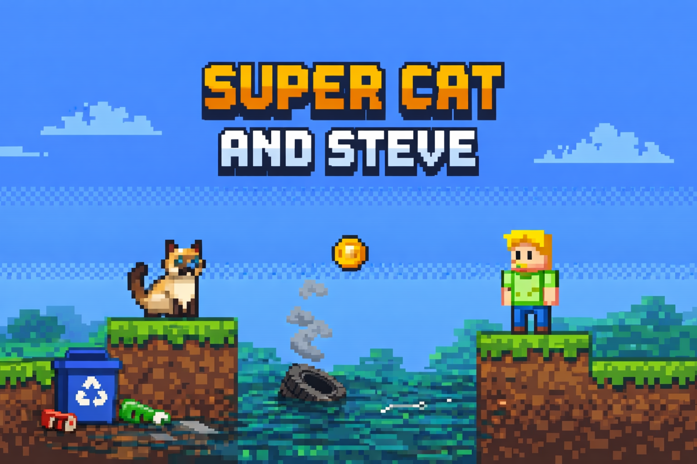
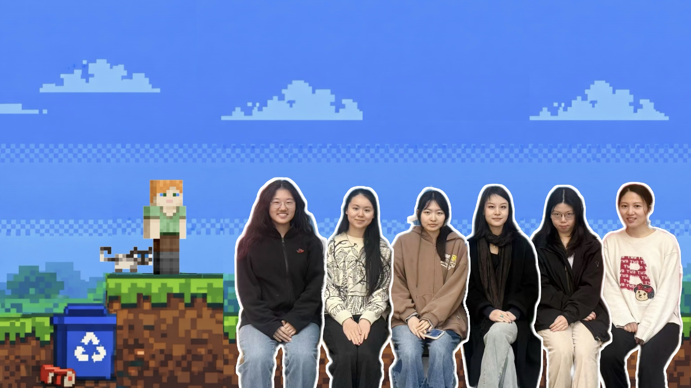

# University of Bristol Software Engineering - Group 15 (2026)

  

<a href="https://github.com/uob-comsm0166/2026-group-15/tree/main#evaluation" target="_blank">Click here to watch our video</a> 
<a href="https://uob-comsm0166.github.io/2026-group-15/SuperCatAndSteve/" target="_blank">Click here to play our game</a>

---

## Table of Contents

- [Team](#team)
- [Introduction](#introduction)
- [Requirements](#requirements)
  - [Case Diagram](#case-diagram)
  - [User Stories](#user-stories)
  - [Early Stage Design](#early-stage-design)
  - [Ideation Process](#ideation-process)
    - [Two Game Ideas](#two-game-ideas)
    - [Stakeholders](#stakeholders)
    - [Team Reflection on Requirements Workshop](#team-reflection-on-requirements-workshop)
- [Design](#design)
  - [Class Diagram](#class-diagram)
  - [Communication Diagram](#communication-diagram)
  - [Design Conclusion](#design-conclusion)
- [Implementation](#implementation)
  - [Camera Movement](#camera-movement)
  - [Physics Engine](#physics-engine)
  - [Gameplay Additions](#gameplay-additions)
- [Evaluation](#evaluation)
  - [Qualitative Analysis - Think Aloud Evaluation](#qualitative-analysis---think-aloud-evaluation)
  - [Quantitative Analysis](#quantitative-analysis)
  - [Unit Testing](#unit-testing)
- [Process](#process)
- [Conclusion](#conclusion)
- [Individual Contribution](#individual-contribution)
- [Additional Marks](#additional-marks)

---

## Team
Yitong Zheng, Li Shen, Xianwen Hu, Jingyu Xiao, Sirui Zhong, Linjing Zhang  

- Group member 1, name, email, role  
- Group member 2, name, email, role  
- Group member 3, name, email, role  
- Group member 4, name, email, role  
- Group member 5, name, email, role  
- Group member 6, name, email, role  

## Introduction
- 5% ~250 words 
- Describe your game, what is based on, what makes it novel? (what's the "twist"?)

## Requirements
- 15% ~750 words
- Early stages design. Ideation process. How did you decide as a team what to develop? Use case diagrams, user stories.

### Case Diagram

### User Stories
| User Story / Epic                                                                                                                                                                                                                                                                                       | Acceptance Criteria                                                                                                                                                                                                                                                                                                                                                                                                                                                                                                                                                              |
| ------------------------------------------------------------------------------------------------------------------------------------------------------------------------------------------------------------------------------------------------------------------------------------------------------- | -------------------------------------------------------------------------------------------------------------------------------------------------------------------------------------------------------------------------------------------------------------------------------------------------------------------------------------------------------------------------------------------------------------------------------------------------------------------------------------------------------------------------------------------------------------------------------- |
| **As** a development team, **I want** players with different skill levels to also get perfect feedback, **so that** I code easy and difficult game levels.                                                                                                                                              | **Given** a player who is new to the game, **when** they choose the easy difficulty setting, **then** they should receive immediate feedback, such as earning points or completing an achievement.                                                                                                                                                                                                                                                                                                                                                                               |
| **As** development Team, **I want** the game take up little storage space, **so that** the game should be portable.                                                                                                                                                                                     | **Given** we have to develop 3 levels for each map, we decided to use pixel background, **when** the game is launched, it can be played online and take up less than 1GB.                                                                                                                                                                                                                                                                                                                                                                                                        |
| **As** a development team,   **I want** the game to take up minimal storage space,  **so that** it is easy to distribute and portable across different devices.                                                                                                                                      | **Given** the game includes three levels for each map,  **when** the game is developed and launched using pixel-style backgrounds and online assets,  **then** the game can be played online and the total storage size is less than 1 GB.                                                                                                                                                                                                                                                                                                                                       |
| **As** a designer, **I want** everyone who plays our game to feel that protecting the environment is a long process, **so that** I make different pollutants in the game levels.                                                                                                                        | **Given** that this game will target players of different age groups, **when** promoting this game, **then** we should consider the preferences of different age demographics and focus on the game’s primary target audience.                                                                                                                                                                                                                                                                                                                                                   |
| **As** a​n artist, **I want** to​ create a set of modular environmental tiles (e.g., land, rocks, trees, backgrounds), **so that**​ the level designer can quickly and flexibly build diverse yet visually cohesive levels.                                                                             | **Given**​ a complete tileset, **when**​ the level designer uses it in the editor, **then**​ all tile edges must connect seamlessly without visual gaps. **Given**​ different biomes (e.g., surface, underground mine), **when**​ switching between them, **then**​ the tiles should have distinct colors and textures to signal the area change. **Given**​ a built level, **when**​ a player views it, **then**​ the foreground, background, and characters must have a clear visual hierarchy to prevent clutter.                                                       |
| **As** a tester, **I want** to test all game levels and difficulty settings thoroughly, **so that** I can ensure the game works correctly and provides a smooth experience for players.                                                                                                                 | **Given** that the game has multiple difficulty levels and environmental challenges, **when** I play through each level and report bugs or unexpected behaviors, **then** the development team should be able to fix issues and improve gameplay stability.                                                                                                                                                                                                                                                                                                                      |
| **As** a publisher, **I want** the game to be released on multiple platforms such as mobile and PC, **so that** more players can easily access and play the game.                                                                                                                                       | **Given** the game is ready for launch, **when** it is published on various platforms and app stores, **then** players should be able to download, install, and play without technical issues.                                                                                                                                                                                                                                                                                                                                                                                   |
| **As** a​ player, **I want** to​ have a clear resource UI display, **so that​** I can always be aware of my current resource status.                                                                                                                                                                    | **Given**​ the game is in progress, **when**​ I look at the interface, **then**​ it must show the current counts of pollutants, energy value, and satiety level. **Given**​ any resource quantity changes, **when**​ the change occurs, **then**​ the UI must update in real-time.                                                                                                                                                                                                                                                                                            |
| **As** an environmentally conscious player, **I want** to explore polluted virtual worlds and undertake missions like helping clean ocean and plant forests, **so that** I can restore ecosystems and feel the impact of my actions on wildlife  while enjoying immersive gameplay.                  | **Given** a polluted level start, **when** I complete cleanup missions, **then** CO2 level drops and biodiversity increases.                                                                                                                                                                                                                                                                                                                                                                                                                                                     |
| **As** a member of the environmental protection department, **I want** to raise society's environmental protection awareness through EcoGuard, **so that** we can collaborate with the game, collect anonymized player data, and engage players in real-world campaigns like ocean waste cleanup.       | **Given** a critical mass of environmentally conscious players, **when** we review and analyze aggregated gameplay data internally, **then** we identify trends to organize tailored eco-activities for different player segments.                                                                                                                                                                                                                                                                                                                                               |
| **As** a professor or teaching assistant, **I want** to review the game design, implementation, and documentation, **so that** I can evaluate whether the project meets the course requirements and learning objectives.                                                                                | **Given** that the game project is submitted for assessment, **when** I play the game and review the technical and design documentation, **then** I should be able to assess the students’ understanding of game development and provide feedback.                                                                                                                                                                                                                                                                                                                               |
| **As** a game reviewer, **I want** to experience and evaluate the gameplay, graphics, and overall fun of the game, **so that** I can provide an objective review and inform potential players about the game’s quality.                                                                              | **Given** that the game is publicly available or provided for review, **when** I play through the game and analyze user experience, **then** I should be able to write a comprehensive review that highlights the game’s strengths and weaknesses.                                                                                                                                                                                                                                                                                                                               |
| **As** the network supervision departments,  **I want** the the game to be educational and positive while encouraging children to learn about environmental protection, **so that** the props in the game should relate to real world and contains that are unsuitable for children should be excluded. | **Given** the game is an environmental protection game designed for children aged 6–12,  **when** a child plays the game continuously for more than 30 minutes,   **then** a clear warning message about the risks of excessive gaming is displayed on screen for at least 10 second. **Given** the game is ready for public release,  **when** it is reviewed by a supervision team consisting of at least 3 educational or child-development experts,  **then** the game must achieve a content safety approval rating of 100% compliance with child protection guidelines. |

### Early Stage Design

<strong>Game Ideas and Discussion Results</strong>

| Game Type | Game Prototype | Game Description | Added Idea Points | Possible Challenges |
|----------|----------------|------------------|-------------------|---------------------|
| Platform Adventure / Roguelike / Mystery Gacha | Super Mario (platforming), Risk of Rain (RNG & risk/reward) | Players control Mario through platforming levels, jumping on enemies, collecting coins, and reaching the end flag. | (1) End-Level Box: 50/50 chance each level (Princess = bonuses, Dragon = player gets weaker but survives). (2) Optional Boxes: Random power-ups in dangerous areas. (3) Time Loop: Restart level, player keeps items/coins, loses health. (4) Princess Blessings: Stack blessings for better rewards and higher Princess rates. | (1) RNG fairness & seed control (2) Dynamic health bar & animation (3) Sprite scaling & collision accuracy (4) State persistence for time loop (5) Particle systems (fireworks) (6) Item effect stacking & timers (7) Box placement & level balance (8) Dynamic probability & pity system |
| Single-player / Multi-player / Arcade / Action / Strategy | Bomber Man | Players navigate a maze, placing bombs to destroy obstacles and enemies within a time limit. Each player has 3 lives. | (1) Explosive Block Types - Chain explosions, mini-bombs, unusual fire patterns  (2) Dynamic Maze - Walls move, paths open, blocks regenerate  (3) Enemy AI Variations - Enemies can kick, throw, or push bombs | (1) Fair random maze generation (2) Ensuring dynamic changes don’t disrupt gameplay (3) Balancing different explosion behaviors |
| Multiplayer / MOBA / Action Strategy | Honor of Kings | A 5v5 MOBA focused on team-based combat, hero roles, strategy, and mechanical skill. | (1) Dynamic map events (2) In-match progression choices (3) Team coordination mechanics (4) Improved tutorials & role guidance (5) Post-match performance feedback | (1) Game balance across heroes & items (2) High learning curve for new players (3) Network latency & server stability (4) Matchmaking fairness |
| Macro Management / Multi-tasking / Tower Defense | Command & Conquer: Red Alert | Players build bases, manage resources, research technology, and command land, sea, and air forces to defeat enemies. | (1) Random storyline events (e.g. cold snaps) (2) Dynamic vision & radar systems (3) Destructible terrain & structures (4) Neutral resource competition | (1) RNG balance issues (2) Collision recalculation after terrain change (3) Fixed enemy paths reduce replay difficulty |
| Puzzle Game / Puzzle Adventure | Rusty Lake, Cube Escape, Monument Valley | Puzzle progression driven by observation, rule learning, experimentation, and information synthesis. | (1) Non-linear clue discovery (2) Consistent rules with fair misdirection | (1) Interaction system accuracy (click/drag) (2) Debugging non-linear puzzle states (3) Puzzle logic & save-state management |
| Tower Defense | Kingdom Rush, Plants vs. Zombies | Players place defensive structures to stop waves of enemies from reaching their base. | Add collectible temporary buffs dropped by monsters to increase strategic depth. | Balancing randomness with strategy, avoiding interruption and visual clutter |
| Puzzle Game / Match-3 | Candy Crush Saga | Players swap tiles to match three or more items to meet level objectives within limited moves. | Add obstacles (chocolate, ice, chains) requiring multiple matches to clear. | Ensuring solvable boards & non-repetitive patterns; smooth animations & particle effects |

### Ideation Process

#### Two Game Ideas

We have selected two game concepts for further development.

The first is a Minecraft-themed 2D platformer. We plan to leverage the iconic pixel art and classic mechanics of Minecraft—such as biome-hopping (from grasslands to deep caves), tool upgrades, and using items like water buckets and TNT—to create a familiar yet fresh exploration and survival experience.

Its major advantages are significantly reduced asset creation by utilizing MC's established visual style and high recognizability among UK audiences. Another key feature of the game is the use of randomly generated enemies, ensuring that each playthrough feels unpredictable. In addition, the game includes multiple environments—such as underground caves, and underwater areas—each with distinct gameplay mechanics and movement constraints.

The second is an environmental puzzle game centered on a core "time reversal" mechanic with platforms or maze maps. The player starts in a fully polluted city and must navigate through it, undo ecological damage by collecting various pollutants and healing affected wildlife. A character selection system with varied stats (e.g., healing vs. cleanup proficiency) influences multiple endings.

A key design feature is that the game encourages players to retrace their steps. During the final phase, players must return along the same path they previously traveled. However, the environment has changed due to their actions, causing new tools, routes, or interactions to appear. This allows players to evaluate whether their choices have successfully led to a cleaner, healthier city. While the theme is impactful and the rewind mechanic is innovative, the main challenges was the complexity of tracking and reversing player's states and the additional asset for branching narratives.

#### Stakeholders
1. The System:
- Development Team
- Designer
- Artists
- Testers
- Publisher
2. The Containing System:
- Players
- Family Member and Friends of Players (Potential Users)
3. The Wider Environment
- Other Teams
- Professors & Teaching Assistants
4. The External Environment
- Environmental Protection Department (Government)
- Network Supervision Departments
- Stockholders
- Regulators

#### Team Reflection on Requirements Workshop
Through the requirements workshop, our team developed a clearer, more systematic way to capture and structure requirements by first analysing the jogging‑app case study and then applying the same techniques to our own environmental protection game. Starting from the case helped us separate the method (stakeholders → epics → user stories → acceptance criteria) from any specific domain, so we could later reuse it for our game design.

​In the case study, we began by identifying stakeholders such as employees, managers, health services, and transport providers, which showed us how many different parties are affected by a single app. From there we defined epics to describe high‑level goals, then broke these into user stories using the “As a… I want… So that…” template, which forced us to think concretely about each stakeholder’s needs and benefits.

We then wrote acceptance criteria in the Given–When–Then format to turn those stories into testable, unambiguous conditions, clarifying what “done” means for each requirement. After this, we transferred the same process to our environmental protection game by identifying our own stakeholders (players, environmental agencies, developers, etc.), grouping their goals into epics, and expressing concrete user stories and acceptance criteria for gameplay, learning outcomes, and technical behaviour.

​Applying these techniques to our game solidified the connection between requirements and the product's core context. It helped us align technical tasks (e.g., efficient asset loading) with business goals (portability) and user values (environmental education), ensuring that every feature we plan serves a clear purpose for both the project and its users.

## Design
- 15% ~750 words 
- System architecture. Class diagrams, behavioural diagrams.

- 

---

### Class Diagram
Write here.

### Communication Diagram
Write here.

### Design Conclusion
Write here.

## Implementation
Write here.

### Camera Movement
Write here.

### Physics Engine
Write here.

### Gameplay Additions
Write here.

## Implementation
- 15% ~750 words

- Describe implementation of your game, in particular highlighting the TWO areas of *technical challenge* in developing your game. 

## Evaluation
- 15% ~750 words

### Qualitative Analysis - Think Aloud Evaluation: 
- **UI/UX:** The gray hint boxes are not prominent enough and are easy to miss.
- **Combat & Mechanics:** 
	- **Enemy Interaction:** Enemy behaviors or hit reactions are needed. Enemies may need a life bar to indicate how many hits are needed before defeating them. 
    - **Controls:** Consider mapping the **Left Click** for attacks.
    - **Hitbox/Range:** The attack animation and the actual attack range need refinement.
        
- **Bugs & Logic:**
    - **Item Persistence:** Tools should not disappear from the inventory after being used.
    - **Lava**: Water cannot be used on the right side of the lava.
    - **Acid pool :** The acid pool should turn entirely blue (to signal a state change).
        
- **Level Design:** 
- **Collision:** Rocks are impossible to jump onto because their **collision boxes** are too large.
- **Inventory:** The slots for tools and pollutants are too narrow/short.

### Quantitative Analysis
We conducted a structured usability and workload evaluation with 10 participants. Each user played the game at two difficulty levels: **Level 1 (Easy)** and **Level 2 (Hard)**.

#### 1. Methodology
* **System Usability Scale (SUS):** A 10-item questionnaire to measure perceived usability.
* **NASA Task Load Index (TLX):** Measured across 6 dimensions to assess mental and physical workload.
* **Statistical Test:** Wilcoxon Signed-Rank Test (Paired, Two-tailed, $\alpha = 0.05$).

#### 2. Data Summary & Statistical Results
1.1.1 raw data

statistical analysis of SUS data:

Data Summary:
| Metric | Level 1 Mean (SD) | Level 2 Mean (SD) | Wilcoxon Statistic | P-value | Significant? |
| :--- | :--- | :--- | :--- | :--- | :--- |
| **SUS Score** | 86.0 | 55.0 | $W = 0$ | $p < 0.01$ | **Yes** |
| **NASA TLX** | 27.6 | 21.9 | $W = 8.5$ | $p > 0.05$ | **No** |

#### 3. Key Findings

##### System Usability Scale (SUS)
The SUS score dropped significantly from **86.0 (Grade A - Excellent)** to **55.0 (Grade F - Poor)**. 
* **Interpretation:** The drastic drop suggests that as difficulty increases, the game's mechanics or UI become significantly more frustrating to use. The current "Hard" mode may be compromising the player's sense of control.

##### NASA Task Load Index (TLX)
Interestingly, the workload did not show a statistically significant difference ($p > 0.05$). 
* **Interpretation:** While players felt the game was "less usable" (via SUS), their overall perceived workload (mental/physical effort) remained relatively stable. This might be due to a small effective sample size ($n=6$ after ties) or players reaching a "ceiling" of effort early on.

### Unit Testing
- Description of how code was tested.

## Process
- 15% ~750 words

- Teamwork. How did you work together, what tools and methods did you use? Did you define team roles? Reflection on how you worked together. Be honest, we want to hear about what didn't work as well as what did work, and importantly how your team adapted throughout the project.

## Conclusion
- 10% ~500 words

- Reflect on the project as a whole. Lessons learnt. Reflect on challenges. Future work, describe both immediate next steps for your current game and also what you would potentially do if you had chance to develop a sequel.

## Individual Contribution
- Provide a table of everyone's contribution, which *may* be used to weight individual grades. We expect that the contribution will be split evenly across team-members in most cases. Please let us know as soon as possible if there are any issues with teamwork as soon as they are apparent and we will do our best to help your team work harmoniously together.

## Additional Marks

You can delete this section in your own repo, it's just here for information. in addition to the marks above, we will be marking you on the following two points:

- **Quality** of report writing, presentation, use of figures and visual material (5% of report grade) 
  - Please write in a clear concise manner suitable for an interested layperson. Write as if this repo was publicly available.
- **Documentation** of code (5% of report grade)
  - Organise your code so that it could easily be picked up by another team in the future and developed further.
  - Is your repo clearly organised? Is code well commented throughout?
