

# University of Bristol Software Engineering - Group 15 (2026)

  

  
  &nbsp;&nbsp;
  <a href="https://uob-comsm0166.github.io/2026-group-15/SuperCatAndSteve/" target="_blank">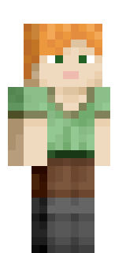</a>

---

## Table of Contents

- [1. Weekly Labs](#1-weekly-labs)
- [2. Team](#2-team)
- [3. Introduction](#3-introduction)
- [4. Requirements](#4-requirements)
  - [4.1 Early-stage Design and Ideation](#41-early-stage-design-and-ideation)
  - [4.2 Stakeholders](#42-stakeholders )
  - [4.3 Use Case Diagram](#43-use-case-diagram)
  - [4.4 User Stories and Acceptance Criteria](#44-user-stories-and-acceptance-criteria)
  - [4.5 Reflection on the Requirements Process](#45-reflection-on-the-requirements-process)
- [5. Design](#5-design)
  - [5.1 Class Diagram](#51-class-diagram)
  - [5.2 Communication Diagram](#52-communication-diagram)
  - [5.3 Design Conclusion](#53-design-conclusion)
- [6. Implementation](#6-implementation)
  - [Challenge 1: Force-Based Movement across Land, Water and Pipes](#challenge-1-force-based-movement-across-land-water-and-pipes)
  - [Challenge 2: Item State Management and Progress Feedback](#challenge-2-item-state-management-and-progress-feedback)
- [7. Evaluation](#7-evaluation)
  - [7.1 Qualitative Analysis](#71-qualitative-analysis)
  - [7.2 Quantitative Analysis](#72-quantitative-analysis)
  - [7.3 Testing](#73-testing)
- [8. Process](#8-process)
- [9. Conclusion](#9-conclusion)
- [10. Individual Contribution](#10-individual-contribution)

---
## 1. Weekly Labs

| **Week** | **Title** | **Documentation** |
|:--------:|:---------------------------------------------------------|:---------------:|
| 01       | Lab 1: Game Ideas                                        | [README](https://github.com/UoB-COMSM0166/2026-group-15/tree/main/Homework_Week1_GameIdeas) |
| 02       | Lab 2: Spray Fun and Brainstorm                          | [README](https://github.com/UoB-COMSM0166/2026-group-15/tree/main/Homework_Week2_SprayFun) |
| 03       | Lab 3: Prototype & Game Selection                        | [README](https://github.com/UoB-COMSM0166/2026-group-15/tree/main/Homework_Week3_Prototypes) |
| 04       | Lab 4: User Stories & Requirements Engineering           | [README](link_to_readme_04) |
| 05       | Lab 5: Object-Oriented Design & Agile Estimation         | [README](link_to_readme_05) |
| 07       | Lab 7: Think Aloud Study & Heuristic Evaluation          | [README](link_to_readme_07) |
| 08       | Lab 8: HCI Evaluation — NASA-TLX & SUS                   | [README](link_to_readme_08) |
| 09       | Lab 9: Quality Assurance — Black-Box & White-Box Testing | [README](link_to_readme_09) |

---

## 2. Team

  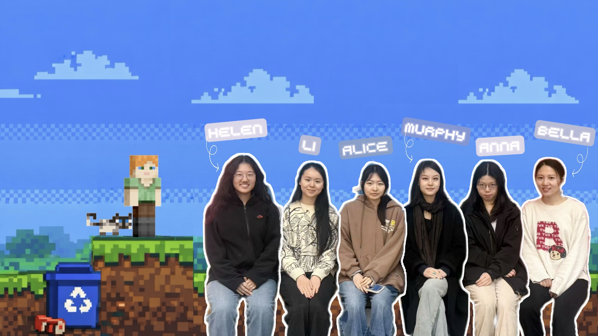

| **Name**              | **Role**                                                      | **Email**             |
|:----------------------|:--------------------------------------------------------------|:----------------------|
| Helen – Yitong Zheng  | Developer, UI Designer, Level Designer, Video Editor          | ul25116@bristol.ac.uk |
| Li – Li Shen          | Developer, Level Designer, UX Designer, Repository Management | cm25322@bristol.ac.uk |
| Alice – Xianwen Hu    | Developer, UI Designer, UX Designer, Video Editor             | ss25944@bristol.ac.uk |
| Murphy – Jingyu Xiao  | Developer, UX Designer, Level Designer, Audio Designer        | zz25762@bristol.ac.uk |
| Anna – Sirui Zhong    | Developer, UI Designer, Level Designer, Audio Designer        | vc25336@bristol.ac.uk |
| Bella – Linjing Zhang | Developer, UX Designer, Level Designer, Repository Management | sn25366@bristol.ac.uk |

---

## 3. Introduction

**Super Cat and Steve** is an environmental-themed platform adventure built around three different worlds: forest, ocean, and factory.

Each level shares the same core. Move forward, jump across platforms, avoid danger, and stay alive. But the goal is not just to reach the end. Players also collect pollutants, use tools, rescue trapped animals, and deal with enemies such as zombies along the way.

### What Makes It Original

*Super Cat and Steve* begins with the structure of a classic pixel-art platform game, but the team wanted it to do more than just ask the player to jump, fight, and survive. The environmental theme shaped the game from an early stage, so the player is asked not only to move through the world, but also to repair it, protect wildlife, and respond to different kinds of hazards in different settings.

This changes the purpose of play. Progress is not only about reaching the end of a level. The player must also rescue trapped animals, use tools correctly, recover health when needed, adapt to new environmental mechanics, and survive a range of enemies and dangerous terrain. In this way, environmental protection becomes part of the gameplay itself rather than just part of the game’s background.

#### Characters

<table border="1" cellpadding="12" cellspacing="0">
  <tr>
    <td align="center" width="50%">
      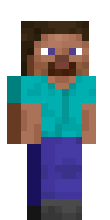  
      <strong>Steve</strong> 
      Steve is the main playable character. The player controls Steve to move through different levels, fight enemies, use tools, rescue wildlife, and survive environmental hazards.
    </td>
    <td align="center" width="50%">
      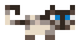  
      <strong>Cat</strong> 
      The cat is Steve’s companion and an important part of the game’s identity. It helps make the world feel more lively and gives the adventure a more recognisable character.
    </td>
  </tr>
</table>

 

#### Main Tasks

<table border="1" cellpadding="12" cellspacing="0">
  <tr>
    <td align="center" width="20%"><strong>Rescue animals</strong></td>
    <td align="center" width="20%"><strong>Use tools</strong></td>
    <td align="center" width="20%"><strong>Fight enemies</strong></td>
    <td align="center" width="20%"><strong>Mine and explore</strong></td>
    <td align="center" width="20%"><strong>Recover health</strong></td>
  </tr>
  <tr>
    <td align="center">Free trapped animals and help restore the environment.</td>
    <td align="center">Use the correct tool in the correct situation to clear hazards or unlock progress.</td>
    <td align="center">Defeat enemies such as zombies, drowned enemies, sharks, slimes, and vexes while moving through each stage.</td>
    <td align="center">Explore the world, move across different terrain, and mine useful blocks to improve equipment.</td>
    <td align="center">Collect healing items such as apples and golden apples to restore health.</td>
  </tr>
</table>

 

#### Tools and Useful Items

<table border="1" cellpadding="12" cellspacing="0">
  <tr>
    <td align="center" width="16.6%">
      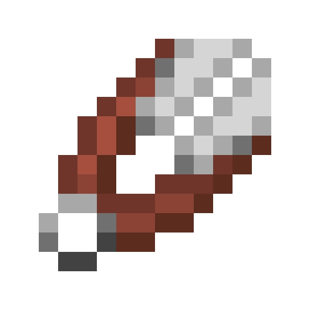  
      <strong>Scissors</strong> 
      Used to cut traps and rescue birds.
    </td>
    <td align="center" width="16.6%">
      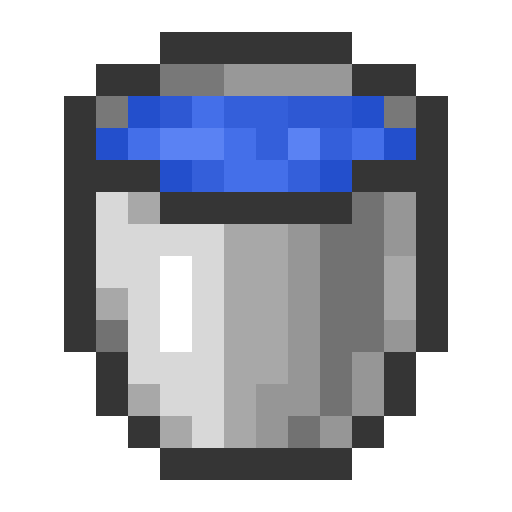  
      <strong>Water Bucket</strong> 
      Used to deal with environmental hazards such as lava.
    </td>
    <td align="center" width="16.6%">
      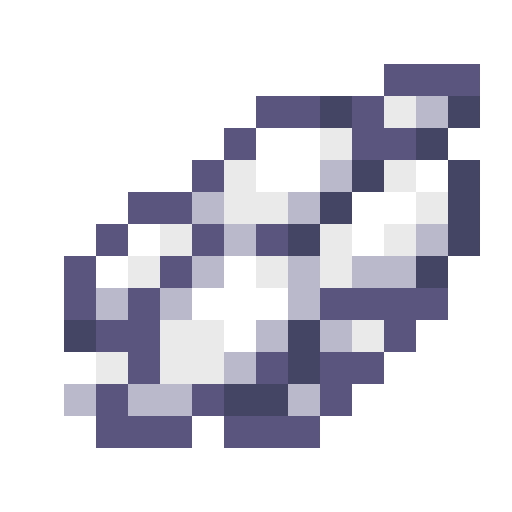  
      <strong>Limestone</strong> 
      Used to neutralise acid pools.
    </td>
    <td align="center" width="16.6%">
      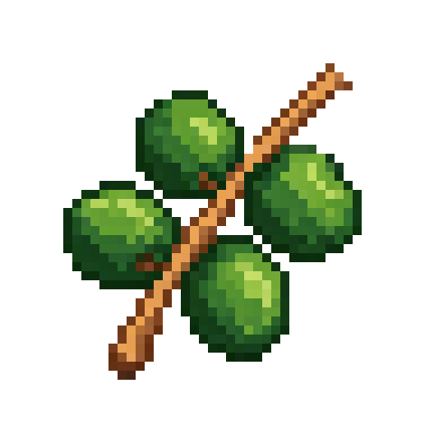  
      <strong>Vine Seed</strong> 
      Used to grow a climbable vine in the forest level.
    </td>
    <td align="center" width="16.6%">
      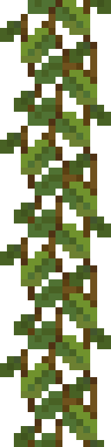  
      <strong>Vine</strong> 
      Created after using the vine seed. It works as a ladder and helps the player reach higher platforms.
    </td>
    <td align="center" width="16.6%">
      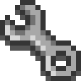  
      <strong>Wrench</strong> 
      An additional environmental tool that fits the game’s industrial and repair-based setting.
    </td>
  </tr>
</table>

 

#### Healing Items

<table border="1" cellpadding="12" cellspacing="0">
  <tr>
    <td align="center" width="50%">
      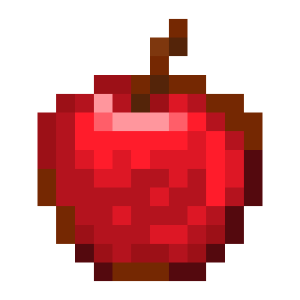  
      <strong>Apple</strong> 
      Restores health when collected.
    </td>
    <td align="center" width="50%">
      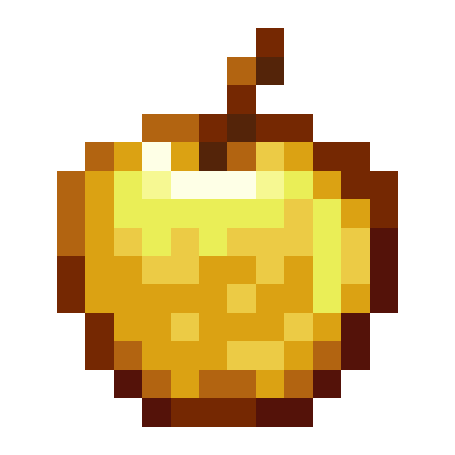  
      <strong>Golden Apple</strong> 
      A stronger healing item that restores more health than a normal apple.
    </td>
  </tr>
</table>

 

#### Rescue Animals

<table border="1" cellpadding="12" cellspacing="0">
  <tr>
    <td align="center" width="33%">
      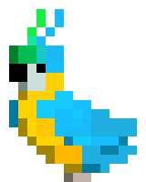  
      <strong>Bird</strong> 
      A rescue target that can be freed with scissors.
    </td>
    <td align="center" width="33%">
      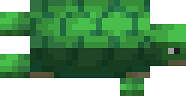  
      <strong>Turtle</strong> 
      One of the animals associated with the ocean level and its rescue theme.
    </td>
    <td align="center" width="33%">
      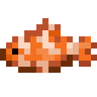  
      <strong>Fish</strong> 
      Another ocean animal that supports the wildlife rescue focus of the game.
    </td>
  </tr>
</table>

 

#### Enemies and Hazards

<table border="1" cellpadding="12" cellspacing="0">
  <tr>
    <td align="center" width="12.5%">
      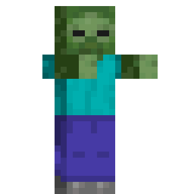  
      <strong>Zombie</strong> 
      A ground enemy that blocks progress.
    </td>
    <td align="center" width="12.5%">
      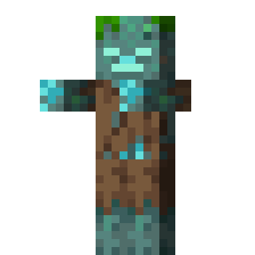  
      <strong>Drowned</strong> 
      An underwater enemy connected to the ocean stage.
    </td>
    <td align="center" width="12.5%">
      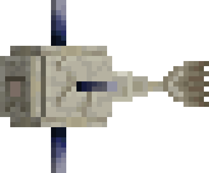  
      <strong>Shark</strong> 
      A marine enemy that adds danger to the ocean world.
    </td>
    <td align="center" width="12.5%">
      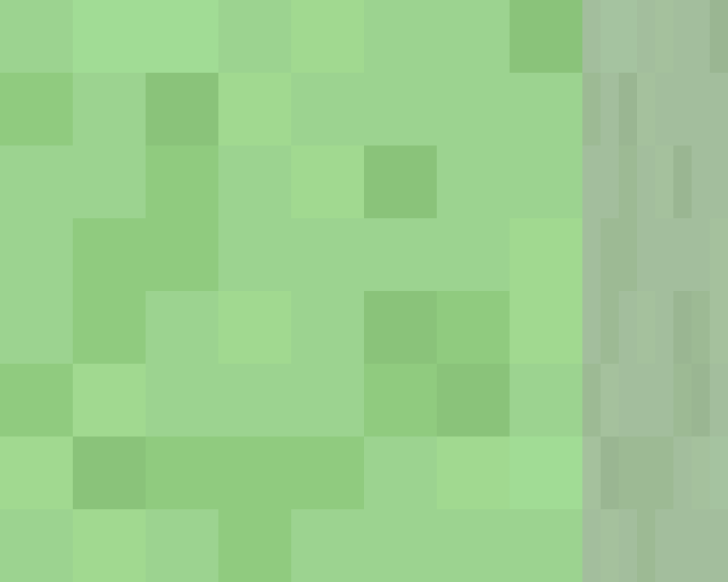  
      <strong>Slime</strong> 
      A hostile creature that adds variety to enemy encounters.
    </td>
    <td align="center" width="12.5%">
      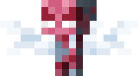  
      <strong>Vex</strong> 
      A flying enemy type that increases combat variety.
    </td>
    <td align="center" width="12.5%">
      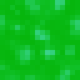  
      <strong>Acid Pool</strong> 
      A dangerous environmental hazard that must be treated correctly.
    </td>
    <td align="center" width="12.5%">
      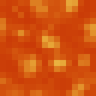  
      <strong>Lava</strong> 
      A lethal hazard that can kill the player instantly.
    </td>
    <td align="center" width="12.5%">
      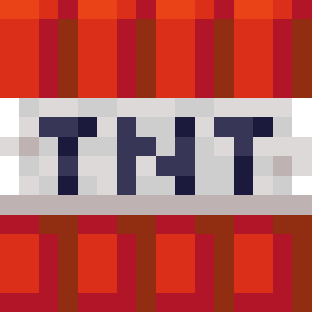  
      <strong>TNT</strong> 
      A dangerous object that the player should avoid.
    </td>
  </tr>
</table>

#### Worlds and Environments

<table border="1" cellpadding="12" cellspacing="0">
  <tr>
    <td align="center" width="33%">
        
      <strong>Forest</strong> 
      The forest world focuses on platforming, rescue, exploration, and early environmental tasks.
    </td>
    <td align="center" width="33%">
        
      <strong>Ocean</strong> 
      The ocean world introduces underwater movement and marine life, with seagrass, coral, kelp, and aquatic enemies.
    </td>
    <td align="center" width="33%">
        
      <strong>Factory</strong> 
      The factory world uses industrial tiles, pipes, and harsher hazards to create a more mechanical and polluted environment.
    </td>
  </tr>
</table>

---

## 4. Requirements

### 4.1 Early-stage Design and Ideation

At the beginning of the project, our team did not decide the final game idea straight away. We first had a brainstorming session where each member suggested possible game types. The ideas we discussed included obstacle-avoidance games such as Snake and Temple Run, matching games like Tetris, level-based platform games inspired by Mario, and battle-style games based on a simplified version of Hearthstone. This gave us several possible directions and helped us compare different types of gameplay before making a decision.

<strong>Game Ideas and Discussion Results</strong>

| Game Type  | Game Prototype   | Game Description  | Added Idea Points  | Possible Challenges  |
|:----------|:----------------|:------------------|:-------------------|:---------------------|
| Platform Adventure / Roguelike / Mystery Gacha | Super Mario (platforming), Risk of Rain (RNG & risk/reward) | Players control Mario through platforming levels, jumping on enemies, collecting coins, and reaching the end flag. | (1) End-Level Box: 50/50 chance each level (Princess = bonuses, Dragon = player gets weaker but survives). (2) Optional Boxes: Random power-ups in dangerous areas. (3) Time Loop: Restart level, player keeps items/coins, loses health. (4) Princess Blessings: Stack blessings for better rewards and higher Princess rates. | (1) RNG fairness & seed control (2) Dynamic health bar & animation (3) Sprite scaling & collision accuracy (4) State persistence for time loop (5) Particle systems (fireworks) (6) Item effect stacking & timers (7) Box placement & level balance (8) Dynamic probability & pity system |
| Single-player / Multi-player / Arcade / Action / Strategy | Bomber Man | Players navigate a maze, placing bombs to destroy obstacles and enemies within a time limit. Each player has 3 lives. | (1) Explosive Block Types - Chain explosions, mini-bombs, unusual fire patterns  (2) Dynamic Maze - Walls move, paths open, blocks regenerate  (3) Enemy AI Variations - Enemies can kick, throw, or push bombs | (1) Fair random maze generation (2) Ensuring dynamic changes don’t disrupt gameplay (3) Balancing different explosion behaviors |
| Multiplayer / MOBA / Action Strategy | Honor of Kings | A 5v5 MOBA focused on team-based combat, hero roles, strategy, and mechanical skill. | (1) Dynamic map events (2) In-match progression choices (3) Team coordination mechanics (4) Improved tutorials & role guidance (5) Post-match performance feedback | (1) Game balance across heroes & items (2) High learning curve for new players (3) Network latency & server stability (4) Matchmaking fairness |
| Macro Management / Multi-tasking / Tower Defense | Command & Conquer: Red Alert | Players build bases, manage resources, research technology, and command land, sea, and air forces to defeat enemies. | (1) Random storyline events (e.g. cold snaps) (2) Dynamic vision & radar systems (3) Destructible terrain & structures (4) Neutral resource competition | (1) RNG balance issues (2) Collision recalculation after terrain change (3) Fixed enemy paths reduce replay difficulty |
| Puzzle Game / Puzzle Adventure | Rusty Lake, Cube Escape, Monument Valley | Puzzle progression driven by observation, rule learning, experimentation, and information synthesis. | (1) Non-linear clue discovery (2) Consistent rules with fair misdirection | (1) Interaction system accuracy (click/drag) (2) Debugging non-linear puzzle states (3) Puzzle logic & save-state management |
| Tower Defense | Kingdom Rush, Plants vs. Zombies | Players place defensive structures to stop waves of enemies from reaching their base. | Add collectible temporary buffs dropped by monsters to increase strategic depth. | Balancing randomness with strategy, avoiding interruption and visual clutter |
| Puzzle Game / Match-3 | Candy Crush Saga | Players swap tiles to match three or more items to meet level objectives within limited moves. | Add obstacles (chocolate, ice, chains) requiring multiple matches to clear. | Ensuring solvable boards & non-repetitive patterns; smooth animations & particle effects |

After careful consideration, we have selected **two game concepts** for further development.

The **first** is a Minecraft-themed 2D platformer. We plan to leverage the iconic pixel art and classic mechanics of Minecraft—such as biome-hopping (from grasslands to deep caves), tool upgrades, and using items like water buckets and TNT—to create a familiar yet fresh exploration and survival experience.

Its major advantages are significantly reduced asset creation by utilizing MC's established visual style and high recognizability among UK audiences. Another key feature of the game is the use of randomly generated enemies, ensuring that each playthrough feels unpredictable. In addition, the game includes multiple environments—such as underground caves, and ocean areas—each with distinct gameplay mechanics and movement constraints.

The **second** is an environmental puzzle game centered on a core "time reversal" mechanic with platforms or maze maps. The player starts in a fully polluted city and must navigate through it, undo ecological damage by collecting various pollutants and healing affected wildlife. A character selection system with varied stats (e.g., healing vs. cleanup proficiency) influences multiple endings.

After choosing this direction, we developed the idea into Super Cat and Steve, **an environmental platform game with three themed levels**: forest, ocean, and factory. From this point, our requirements became more specific. The game needed to support basic movement, double jump, combat, item use, mining, score-based level completion, and interactions with environmental hazards. It also needed to include systems for collecting pollutants and rescuing trapped animals, since these actions were central to the theme of the game. According to the current gameplay design, players choose a level at the start, use keyboard controls to move, attack zombies with the F key, use the mouse for tools and mining, and pass the level by gaining enough score through cleanup and rescue tasks.

**The following is a paper prototype of our game:**

### 4.2 Stakeholders 

To make our requirements clearer, we used the approach introduced in the requirements workshop. We first identified the stakeholders for the game, then grouped their needs into broader epics, and finally turned these into user stories and acceptance criteria. This was useful because it made us think about the project from different perspectives instead of only from the programmer’s side. In our materials, the stakeholders included not only players but also the development team, artists, testers, publishers, reviewers, teaching staff, and organisations interested in environmental education. This wider view helped us think more carefully about usability, portability, educational purpose, and overall presentation.

The player was still the main stakeholder, so most of our functional requirements were written around the player’s actions. A player should be able to choose a level, move through the environment, avoid or attack enemies, collect pollutants, use tools, rescue animals, and complete the level by earning enough points. However, writing these requirements as user stories made them more precise. Instead of saying that the game should be “interesting” or “educational”, we had to describe exactly what the user would do and what the system should return in response. The acceptance criteria were especially helpful because they gave us a simple way to decide whether a feature worked properly or not.

### 4.3 Use Case Diagram

This use case diagram shows the main ways the player interacts with Super Cat and Steve. The player starts the game, selects a level, and then enters the main part of the gameplay, shown here as Explore Level. From this point, the player can carry out several different actions during the level, such as collecting pollutants, rescuing animals, using tools, fighting enemies, and mining resources.

We placed Explore Level at the centre of the diagram because it is the core activity of the game. Most of the important gameplay actions happen during exploration, while Complete Level represents the final objective. In our game, finishing a level is closely connected to environmental tasks, especially pollutant collection and animal rescue. For this reason, these two actions are shown as key parts of level completion. Overall, the diagram highlights that environmental protection is built into the gameplay itself rather than added only as background theme.

### 4.4 User Stories and Acceptance Criteria

The following user stories were selected from our earlier requirements discussion and refined into a smaller set of core stories. We focused on the stories that were most closely related to the final version of *Super Cat and Steve*, especially its environmental theme, level design, player interaction, and testing needs.

| User Story / Epic | Acceptance Criteria |
| --- | --- |
| **As** a player, **I want** to move through different levels, collect pollutants, and rescue trapped animals, **so that** I can make progress while experiencing the environmental theme of the game. | **Given** the player is in a level, **when** they collect pollutants or rescue animals, **then** their score should increase accordingly. **Given** the player reaches the required score, **when** the level objectives are completed, **then** the player should be able to pass the level. |
| **As** a player, **I want** to use tools in different situations, **so that** I can deal with hazards and complete environmental tasks more effectively. | **Given** the player has collected the correct tool, **when** they use it in the appropriate situation, **then** the related hazard or obstacle should be removed or reduced. **Given** the player uses the wrong tool, **when** the action is triggered, **then** the game should not apply the intended effect. |
| **As** a designer, **I want** each level to represent a different environmental setting, **so that** players can experience a wider range of ecological problems during the game. | **Given** the player enters a new level, **when** the environment changes, **then** the level should show a distinct theme such as forest, ocena, or factory. **Given** the player moves between levels, **when** the new scene loads, **then** the visual style and environmental challenges should clearly differ from the previous one. |
| **As** an artist, **I want** to create modular environmental tiles and assets, **so that** levels can be built efficiently while still looking visually consistent. | **Given** a complete tileset, **when** it is used to build a level, **then** tile edges should connect without obvious gaps. **Given** different themed levels, **when** players view them, **then** the foreground, background, and characters should remain visually clear and easy to distinguish. |
| **As** a player, **I want** a clear resource and status UI, **so that** I can understand my current progress and react quickly during gameplay. | **Given** the game is in progress, **when** the player looks at the interface, **then** the UI should display key information such as score, health, or collected items. **Given** the player’s status changes, **when** the change happens, **then** the UI should update immediately. |
| **As** a tester, **I want** to test the game across different levels and gameplay situations, **so that** I can identify bugs and help improve stability. | **Given** the game includes multiple levels, enemies, and environmental mechanics, **when** a tester plays through them, **then** unexpected behaviour should be recorded and reported clearly. **Given** bugs are found, **when** the development team reviews the reports, **then** the issues should be reproducible and fixable. |
| **As** a professor or teaching assistant, **I want** to review the game design, implementation, and documentation, **so that** I can assess whether the project meets the module requirements. | **Given** the project has been submitted, **when** I review the game and its documentation, **then** I should be able to understand the design decisions, core features, and technical work completed by the team. |

### 4.5 Reflection on the Requirements Process

Through the requirements workshop, our team developed a clearer, more systematic way to capture and structure requirements by first analysing the jogging‑app case study and then applying the same techniques to our own environmental protection game. Starting from the case helped us separate the method (stakeholders → epics → user stories → acceptance criteria) from any specific domain, so we could later reuse it for our game design.

​In the case study, we began by identifying stakeholders such as employees, managers, health services, and transport providers, which showed us how many different parties are affected by a single app. From there we defined epics to describe high‑level goals, then broke these into user stories using the “As a… I want… So that…” template, which forced us to think concretely about each stakeholder’s needs and benefits.

We then wrote acceptance criteria in the Given–When–Then format to turn those stories into testable, unambiguous conditions, clarifying what “done” means for each requirement. After this, we transferred the same process to our environmental protection game by identifying our own stakeholders (players, environmental agencies, developers, etc.), grouping their goals into epics, and expressing concrete user stories and acceptance criteria for gameplay, learning outcomes, and technical behaviour.

​Applying these techniques to our game solidified the connection between requirements and the product's core context. It helped us align technical tasks (e.g., efficient asset loading) with business goals (portability) and user values (environmental education), ensuring that every feature we plan serves a clear purpose for both the project and its users.

Looking back, the requirements stage was not just an early planning task. It played an important role in shaping the whole project. It helped us choose an idea that matched both our interests and our technical ability, and it also gave us a clearer structure for development. Without that stage, the game would probably have remained a general “environmental game” idea rather than becoming a more focused platform adventure with clear goals and mechanics.

---

## 5. Design

- 15% ~750 words 
- System architecture. Class diagrams, behavioural diagrams.

- 

### 5.1 Class Diagram
Write here.

### 5.2 Communication Diagram
Write here.

### 5.3 Design Conclusion
Write here.

---

## 6. Implementation

When we started building our game, we quickly realised that most of our time would go into two things: getting the movement to feel right across different environments, and making our item and feedback systems line up with the environmental story we wanted to tell. That sounds like just two clear goals, but in code it turned into a lot of small decisions, broken prototypes, and constant adjusting of parameters.

### Challenge 1: Force-Based Movement across Land, Water and Pipes

Our original plan for movement was fairly simple: a standard platformer jump on land, slower motion in water, and some kind of “being pushed” feeling in the pipes. The tricky part was doing this without writing three completely separate controllers, because that would have been hard to maintain and even harder to tune.

In the end we kept one movement loop based on a velocity vector and a set of forces, and then changed the forces depending on where the player was. On land, the character has an upward impulse when jumping and a constant gravity pulling them down each frame. That part is quite standard, but we found that if we used the same gravity for going up and coming down, the character’s movement no longer felt natural or responsive. So we experimented with slightly different values for upward and downward motion: going up is a bit lighter and coming down is a bit heavier. This gives the player finer control over their jumps while still keeping a sense of weight when the character falls back onto a platform.

Water exposed a lot of small problems in our first implementation. Simply turning gravity down made the character drop more slowly, but it still looked like they were moving through air. To fix this we added an upward buoyancy force and horizontal drag. Buoyancy cancels out part of gravity so that the character sinks and rises more gently, and drag reduces horizontal speed so that the player cannot move around as quickly as on land. The underlying code is still the same “velocity plus forces” update, but the values are very different, and that difference is what gives the ocean level its distinct feel.

Pipes added another layer to this. In those sections, the player isn’t really choosing their speed any more - they’re mostly being carried by the water. For this we introduced a flow force that pushes the character along the pipe, plus friction so that they do not accelerate forever. Getting this balance right took a few tries. Early versions felt either too weak (the pipe might as well not exist) or too strong (the player shot across the screen with almost no control). Only after several rounds of playtesting did we find a combination where the pipe feels powerful but the player still has time to react to hazards.

What really made this whole part challenging was the interaction between environments. A change that improved jumping in the forest could easily break the feeling of exiting water, or make pipe sections impossible to control. To keep this manageable, we separated configuration from logic. The update function itself is shared, but each environment defines its own gravity, buoyancy, drag and flow force. This meant that during tuning sessions we could leave the code alone and only adjust data, which is much less risky when the deadline is close.

### Challenge 2: Item State Management and Progress Feedback

The second big implementation challenge was the item system. Quite early on we realised that “collectable items” in our game actually belong to two different categories. Some are tools, like scissors, that the player uses once to help an animal and then should disappear. Others are pollutants, like plastic bottles, which should not magically vanish as soon as they are picked up. They are supposed to be cleaned up and sorted properly, not just converted into points.

This distinction sounds obvious from a design perspective, but it changed the way we had to write the inventory. A simple “pick up item → remove from world → add to inventory” approach was not enough. For tools we needed a small lifecycle: the player picks up the tool, the tool appears in the backpack, a specific interaction (for example using scissors to cut a bird free from a net) checks whether the required tool is available, and if the interaction succeeds the tool is consumed and removed from the inventory. For pollutants, we almost want the opposite behaviour: the plastic bottle leaves the level, is added to the player’s backpack, and contributes to the score or progress until it is processed elsewhere.

To handle this, we ended up tagging items with a type and giving each type its own set of rules. Tools can be consumed and removed from the inventory; pollutants stay in the backpack, contribute to score or progress, and may later be processed in other parts of the level. Some items unlock interactions, while others mainly affect scoring and progression. On its own this is not a very complicated system, but it becomes more interesting when combined with feedback to the player.

Originally, our plan was to have a hint cat follow the player around the level. The cat was meant to guide the player and also act as a reminder of rescue progress, pollutant collection, and nearby dangers. We did get a basic following behaviour working, but once we added moving platforms, vertical layouts and hazards like acid pools, the number of edge cases exploded. The cat sometimes floated in mid-air, sometimes walked through dangerous tiles, and sometimes got stuck while the player moved on. Each fix added more special cases to the code and still did not cover every situation.

At that point we stepped back and asked what the hint cat really needed to do. The more we discussed it, the more it felt like the important part was not that the cat physically walked behind the player, but that it gave the player clear feedback and a sense of progress. That led to the solution we use now: the hint cat lives in the UI as part of a progress bar at the top of the screen. As the player rescues animals and handles pollution correctly, the progress bar fills and the cat moves along with it.

From an implementation perspective, this was much cleaner. The same event system that updates the inventory also updates the progress bar, and we no longer have to simulate another character inside the level. It also worked better in playtests: players understood the bar immediately and spent less time worrying about why the cat was stuck on a platform behind them. In that sense, this challenge was as much about knowing when to simplify a feature as it was about solving a technical problem.

待添加图片：
图 1-3 Movement across environments GIF，展示 land jump → ocean movement → pipe current，展示森林跳跃 → 水下浮力 → 管道冲力
图 4-5：Tool collection and item use 一张截图，展示剪刀解救小鸟，显示工具收集、使用后消失。
图 6：Progress bar with helper cat 一张截图，展示顶部 UI 和猫进度，显示进度反馈如何工作。

---

## 7. Evaluation

### 7.1 Qualitative Analysis

To evaluate the usability and overall experience of our game, we used a qualitative approach that combined a **Think Aloud evaluation** with a **heuristic analysis** based on Nielsen’s usability guidelines. These methods helped us understand how players actually played the game, where they became confused, and which usability issues should be prioritised in later iterations.

#### 7.1.1 Think Aloud Evaluation

We conducted a **Think Aloud evaluation** on the **first forest level** and the **partially implemented second ocean level** to identify usability issues during gameplay.

**Key Findings**

- **Guidance and information**  
  - Grey hint boxes were often overlooked until players were stuck, which suggests that their visibility is not sufficient, especially for younger players.

- **Combat and controls**  
  - Enemies showed little reaction when hit and there were no clear health indicators, so players could not easily tell whether their attacks were successful or how many hits were required.  
  - Some players instinctively tried **Left Click** to attack and mentioned that the attack animation did not match the actual hit range.

- **Items and environment behaviour**  
  - Some tools stayed in the inventory after use while others disappeared, leaving players unsure whether tools were meant to be reusable or single‑use.  
  - Lava could only be cleaned from one side, forcing players to backtrack, and cleaned acid pools looked unchanged, so it was hard to see whether an area was finished.

- **Movement and interface**  
  - Rock collision boxes felt too large, making some jumps effectively impossible because of invisible boundaries.  
  - Inventory slots were narrow, which made it difficult to collect and quickly review all tools and pollutants.

#### 7.1.2 Heuristic Analysis

**Method**  

To complement the Think Aloud evaluation, we conducted a heuristic analysis of the same two levels. The main issues identified in the Think Aloud sessions were mapped to Nielsen’s usability heuristics and rated on **frequency**, **impact**, and **persistence** on a 0–4 scale. A **severity score** was then calculated as the average of these three values to help us prioritise the issues more systematically in later iterations.

**Issues and Severity**

| **Interface**    | **Issue**                                                                                                 | **Heuristic(s)**                                             | **Frequency (0–4)** | **Impact (0–4)** | **Persistence (0–4)** | **Severity** |
|:----------------:|-----------------------------------------------------------------------------------------------------------|:-------------------------------------------------------------|:-------------------:|:----------------:|:---------------------:|:-----------:|
| Hints            | Grey hint boxes are easy to miss; players often only notice hints after getting stuck.                    | H1 – Visibility of system status; H10 – Help & documentation |         3           |        4         |           3           |   **3.3**   |
| Combat           | Enemies show weak hit feedback and there are no clear health indicators.                                  | H1 – Visibility of system status; H5 – Error prevention      |         3           |        4         |           3           |   **3.3**   |
| Combat / Controls| Attack controls and hitboxes are unclear; some players try Left Click and feel the hit range is inconsistent. | H2 – Match between system and real world; H4 – Consistency & standards |         2           |        3         |           3           |   **2.7**   |
| Inventory        | Tool behaviour is inconsistent; some tools disappear after use while others remain.                       | H4 – Consistency & standards; H6 – Recognition rather than recall |         2           |        3         |           2           |   **2.3**   |
| Environment      | Cleaning lava/acid does not always give clear visual feedback; acid pools look unchanged when cleaned.    | H1 – Visibility of system status; H5 – Error prevention      |         2           |        3         |           2           |   **2.3**   |
| Movement         | Rock collision boxes feel larger than sprites, making some jumps effectively impossible.                  | H2 – Match between system and real world; H8 – Aesthetic & minimalist design |         2           |        4         |           2           |   **2.7**   |
| UI / Inventory   | Inventory layout is narrow, making it hard to see and manage all tools and pollutants.                    | H8 – Aesthetic & minimalist design; H6 – Recognition rather than recall |         1           |        2         |           2           |   **1.7**   |

> Severity = (Frequency + Impact + Persistence) / 3

**Interpretation**

The heuristic analysis reflects and structures the issues observed in the Think Aloud evaluation:

- **Guidance and information** – Issue 1 confirms that hint visibility is too low, matching player reports that they only noticed grey hint boxes after getting stuck.  
- **Combat and controls** – Issues 2 and 3 relate to weak combat feedback and unclear attack controls, consistent with players not knowing whether hits were registered or which input to use.  
- **Items and environment behaviour** – Issues 4 and 5 capture inconsistent tool behaviour and unclear environmental changes, making it harder for players to understand how cleaning mechanics work and when an area is complete.  
- **Movement and interface** – Issues 6 and 7 align with feedback about oversized collision boxes and a cramped inventory, which affects both movement fairness and the readability of collected items.

#### 7.1.3 Follow-up Changes

In later iterations, we increased hint visibility, improved combat feedback and hitbox alignment, made tool and environment behaviour more consistent, and adjusted collision boxes and the inventory layout to make the game easier to play and understand.

***

### 7.2 Quantitative Analysis

We conducted a structured usability and workload evaluation with **10 participants**. Each participant played the game at two difficulty levels: **Level 1 (Easy)** and **Level 2 (Hard)**.

#### 7.2.1 Method

- **System Usability Scale (SUS):** 10‑item questionnaire to measure perceived usability.
- **NASA Task Load Index (NASA‑TLX):** Six subscales to assess mental and physical workload.
- **Statistical test:** Wilcoxon signed‑rank test (paired, two‑tailed, $\alpha = 0.05$).

#### 7.2.2 Data Summary and Statistical Results

  

  

  

> Raw SUS and NASA‑TLX scores for both difficulty levels are shown in the figures above.

**Summary**

| Metric         | Level 1 Mean (SD) | Level 2 Mean (SD) | Wilcoxon Statistic | P‑value   | Significant? |
| :------------: | :---------------: | :---------------: | :----------------: | :-------: | :----------: |
| **SUS score**  | 86.0              | 55.0              | $W = 0$            | $p < 0.01$| **Yes**      |
| **NASA‑TLX**   | 27.6              | 21.9              | $W = 8.5$          | $p > 0.05$| **No**       |

#### 7.2.3 Key Findings

**System Usability Scale (SUS)**

The SUS score decreased from **86.0** (Grade A – excellent usability) at Level 1 to **55.0** (Grade F – poor usability) at Level 2, and this difference was statistically significant ($p < 0.01$).

- **Interpretation:** As difficulty increases, players perceive the game as noticeably less usable. This suggests that elements of the mechanics or interface in the Hard mode reduce the sense of control or clarity, and should be reviewed in future iterations.

**NASA Task Load Index (NASA‑TLX)**

NASA‑TLX scores did **not** show a statistically significant difference between Level 1 and Level 2 ($p > 0.05$).

- **Interpretation:** Although players rated the Hard mode as less usable in SUS, their overall perceived workload (mental and physical effort) remained at a similar level. This may be influenced by the small effective sample size (ties reduced the number of usable pairs to $n = 6$) and by players reaching a stable effort level early in the task rather than increasing effort further in the Hard condition.

***

### 7.3 Testing
- Description of how code was tested.

### 7.3.1 Black-Box Testing

We used black-box testing to evaluate whether the main gameplay features behaved as expected from the player’s point of view, without focusing on the internal code structure. The tests covered core interactions such as movement, digging, combat, item collection, rescue actions, damage, death conditions, UI buttons, and map boundaries. This helped us check whether the visible behaviour of the game matched the intended design and whether key mechanics were understandable and reliable during play.

| Test Group | Precondition | Test Steps | Expected Result |
|---|---|---|---|
| Dig | The player is close to a terrain tile. | Long press on the tile. | The tile disappears. |
| Dig | The player is close to an iron ore tile. | Long press on the tile. | The tile disappears, and the sword is upgraded to an iron sword. |
| Move | None. | Press **A**. | The player moves to the left. |
| Move | None. | Press **D**. | The player moves to the right. |
| Move | None. | Press **W**. | The player jumps or moves upward. |
| Move | None. | Press **S**. | The player squats. |
| Attack | The player is close to an enemy. | Press **F**. | The enemy disappears after 3 attacks. |
| Save | The player is close to the scissors and a trapped bird. | Move to the scissors, collect them, and then move close to the bird. | The scissors are collected and the bird is saved. |
| Collect | The player is close to an item. | Move to the item. | The item is collected and added to the inventory. |
| Injure | The player is close to an apple. | Touch the apple. | The player gains health. |
| Die | The player is in a dangerous situation. | 1. Fall into lava; 2. Step on TNT; 3. Be attacked by an enemy. | The player dies immediately. |
| Quit during playing | None. | Click the exit button. | The game returns to the start page. |
| Menu during playing | None. | Click the menu button. | The game shows the pollutants, animals, and tools in the current frame. |
| Boundary | None. | Hold **W** long enough to touch the upper boundary. | The player moves out of the visible canvas; when the key is released, the player falls back down. |
| Boundary | None. | Touch the lower boundary. | The player dies. |
---

## 8. Process

From the beginning, we treated our game as a shared design project rather than just a piece of coursework. We did not appoint a formal team leader. Instead, we worked with shared ownership of the game concept and environmental theme, while each member still had a main area they focused on, such as programming, level design, UI/UX, art, audio, or evaluation. In discussions we were less interested in “who owns this file?” and more interested in questions like “what does this change mean for the player?” and “does it support our environmental education goal for children?”.

### How we organised our work

A practical question we asked ourselves early on was how to organise work so that we could keep moving, but still react to new ideas and feedback. We ended up following a light‑weight **Agile** approach based on short iterations, regular discussion, and continuous adjustment rather than a fixed plan from the start. Most weeks, we held a team meeting of around one hour, usually before or after the workshop, to review progress and agree on the next priorities. These meetings were used to report what had already been completed, identify the main focus for the coming week (for example, *connect pollutant collection to the scoring system*, *make the forest level playable end-to-end*, or *finalise enemies and rescue targets for the ocean level*, refine game details, and discuss any problems that had come up during development. Our aim was always to keep a version of the game in a playable state, even if some assets or UI elements were still temporary, because this made it easier to see whether something was fun or confusing instead of debating it only at the design level.

Outside the weekly meetings, we relied on quick communication through a group chat. Smaller issues, such as UI placement, wording, minor gameplay adjustments, or bug updates, were usually discussed there or through one‑to‑one messages, which was much more efficient than waiting for the next full meeting. This gave us a balance between structured weekly planning and day‑to‑day flexibility.

For task tracking and collaboration, we mainly used the **GitHub kanban board** to assign work and monitor progress. Features, bugs, and design tasks were broken down into smaller cards and moved through the board as development continued. We also used GitHub branches and pull requests to manage code changes so that the main branch stayed stable enough for testing. In terms of development tools, **Visual Studio Code** was our main coding environment. For sprite and tile creation, we used **Pixelorama** and **Piskel**, and for diagrams such as use‑case and planning visuals, we used **draw.io**. Keeping the project within a small and consistent set of tools made collaboration much easier, especially when one member needed to step into another person’s work.

### How workshops and discussion shaped the game

The **workshops** this semester had a clear influence on how we thought about the game. Instead of treating Agile, requirements, evaluation and testing as separate topics, we tried to mix them into our normal workflow. The Agile sessions reminded us to keep the work in small steps, get something running early, and review it often. The requirements activities (stakeholders, user stories, acceptance criteria) helped us turn rough ideas into clearer expectations for the game. They made us spell out who we were designing for, what those players should be able to do, and what “done” should look like. This also made it easier to see how small tasks, like adding a tool or changing a level, linked back to the overall goal of making an environmental game that children can understand and play. Later, the evaluation workshops gave us a way to check whether we were actually meeting those expectations. We used Think Aloud, heuristic evaluation, SUS and NASA‑TLX not just to collect numbers, but to see which parts of the game worked well and which parts confused or frustrated players. The feedback led to concrete changes, for example to hint visibility, combat feedback, movement and the inventory layout, so that the game better matched what players needed. Altogether, this helped us move from a loose “environmental game” idea to a version of Super Cat and Steve that we could actually build, test and improve step by step.

On top of this, a recurring question in our own meetings was how to make the game **meaningful as an environmental game for younger players**, rather than just another platformer with a theme attached. We often asked how to make the game both educational and enjoyable: how to design more interesting levels, suitable enemies and animals, clearer environmental tasks, and a more user‑friendly interface. These conversations directly shaped the structure of the game.

For example, we designed three themed worlds - **forest**, **ocean**, and **factory** - so that each level could present a different type of environmental issue. We also discussed what kinds of enemies and trapped animals would fit each setting, and how different pollutants should appear in gameplay. Common pollutants like plastic bottles are collected directly, while more hazardous elements such as acid pools require specific tools (e.g. limestone) to neutralise them. These ideas were developed collectively in meetings and then refined through implementation and playtesting, rather than being decided by a single person.

### Challenges and how we adapted

Our collaboration was not without problems, and on several different levels we had to change the way we worked.

On the **UI and visual asset level**, we realised that our early tiles, tools and UI elements had been drawn without a shared standard for size or style. When we put them together in the game, some tools looked far too big while others were very small, and assets made by different people did not really match visually. To fix this, we agreed on common pixel sizes for tiles, characters and items, went back and adjusted older assets, and let a smaller group finish the final sprites while others focused more on feedback and integration.

On the **movement and gameplay level**, early versions of jumping, ocean movement and pipe traversal did not feel natural. Test players described the motion as “floaty”, and we also noticed that the character sometimes seemed to hover instead of having a clear sense of weight. After talking to other groups and reviewing our own code, we realised that we were mostly changing positions directly rather than modelling movement with force, acceleration and velocity. We then rebuilt the movement systems with this in mind, which made jumping, ocean buoyancy and other environmental movement feel more believable.

On the **mechanics design level**, we also struggled with the original **follower-cat mechanic**. Our first idea was for the cat to move with the player through the level, but once we added more vertical layouts and hazards, the behaviour became unstable. The cat could float in mid‑air, follow strange paths, or walk into acid and lava when the player turned around. After several attempts to adjust the logic, we decided to simplify the feature and move the cat into the UI as a progress indicator instead. This reduced the “pet companion” feeling, but it gave players a clearer sense of progression and removed a lot of technical problems.

On the **testing and evaluation level**, we initially assumed that tasks would naturally be shared by everyone, but in practice this meant that recruiting players, taking notes and organising results were not clearly owned by anyone. For example, it was sometimes unclear who should contact potential participants and arrange time slots for Think Aloud and questionnaire sessions. After the first evaluation round, we made these roles more explicit: one member took charge of recruiting and scheduling players, while others rotated as observers and note‑takers using shared templates. This made later Think Aloud studies, heuristic evaluations and SUS/NASA‑TLX data collection more organised and easier to link back to specific changes in the game.

### Reflection

Looking back, we realised that many of the problems we met were less about individual skills and more about how we organised the work. Agreeing on shared rules for UI and visual assets showed us that basic standards need to be set early if we want a consistent result. Rebuilding movement and rethinking the follower‑cat mechanic reminded us to prototype quickly, listen to feedback, and be prepared to simplify or drop ideas that do not work in practice. Making roles clearer for testing and evaluation also showed that recruiting players, taking notes and organising data are real responsibilities that need to be assigned, not left for “someone” to handle.

At the same time, regularly asking what each change meant for players and for the environmental message helped us stay close to our original aim. Overall, the project did not just give us a three‑world environmental platform game, but also practice in balancing creative ideas, technical limits and the needs of young players within a small team.

---

## Sustainability

We reviewed the Green Software Foundation implementation patterns for web systems and selected the ones that were most relevant to a browser-based p5.js game. Since our project runs entirely on the client side and depends heavily on image assets, rendering, and repeated updates in the game loop, the most useful patterns were the ones related to **image size**, **request count**, **unnecessary data collection**, and **runtime work in the browser**. The catalogue describes these patterns as practical ways to reduce bandwidth, storage, and device-side processing, which made them relevant to our project even at a small scale.

### Optimize image size

One pattern we clearly used was **Optimize image size**. The Green Software Foundation recommends storing images at dimensions close to the size at which they are actually displayed, so that bandwidth and processing are not wasted on oversized assets. In our game, this was especially important because most of the visuals are pixel art rather than large painted backgrounds. We deliberately kept the pixel assets small, and our art workflow also controlled sprite dimensions to avoid loading problems. In the code, this design is reflected in the fixed low-resolution canvas (`640 × 360`), the standard `32 × 32` tile system, and several small UI or weapon sprite sizes. This helped keep the game visually consistent while also reducing unnecessary asset size.

### Keep request counts low

A second relevant pattern was **Keep request counts low**. The catalogue explains that fewer files and requests reduce the energy needed to display a page. Our game does not generate a separate image for every terrain block. Instead, it reuses a limited set of tile textures and draws them repeatedly through a tile mapping system. The same approach is used for decorative objects, sprites, and UI icons: resources are loaded once, stored under shared keys, and then reused in different parts of the game. This is visible in the central image-loading logic and in helper functions such as `getTextures()` and `drawTile()`. In practice, this meant we could build long levels and multiple environments without a huge number of unique asset files.

### Avoid tracking unnecessary data

Another pattern we followed, at least by design, was **Avoid tracking unnecessary data**. The Green Software Foundation points out that user tracking and extra data collection add environmental cost through additional scripts, processing, storage, and network traffic. Our game is a local browser game and, in the current code we reviewed, there is no evidence of analytics, advertising scripts, or external tracking requests. This means the game avoids a common source of unnecessary overhead in modern web applications. For a student project, this was not only simpler to implement, but also aligned well with the idea of keeping the system lightweight.

### Minimize main thread work

The fourth pattern, **Minimize main thread work**, was only partly addressed, but it is still relevant to our implementation. Browser games run much of their logic on the main thread, so unnecessary updates can quickly affect performance. In our code, some choices already move in this direction. For example, enemies are not fully active from the start; they are first activated only when the player enters a defined detection range. Decorative elements such as trees, coral, kelp, and water are also separated from full collision platforms, which reduces the amount of collision work the system needs to perform. Cooldown values and delayed attack checks are also used to stop certain actions from being processed every possible frame. These decisions do not eliminate main-thread pressure, but they do show an effort to keep repeated computations under control.

---

## 9. Conclusion
Overall, this project helped us understand how difficult it is to turn a simple game idea into a working product. At the start, Super Cat and Steve seemed like a fairly straightforward platform game with an environmental theme. However, once we started building it, we realised that many small ideas were much harder to implement than expected. This was one of the biggest lessons from the whole project: in game development, even simple mechanics can become complicated when they interact with physics, level design, and player control.

One of the most difficult parts was the cat-following mechanic. We wanted the cat to move naturally with the main character, but this was harder than we first thought. Because the game contains multiple layers of platforms, the cat sometimes judged the wrong platform as the ground and moved to the upper level by mistake. In other situations, when the player jumped, the cat would also jump even though it was not always necessary. Solving this problem made us realise that companion behaviour needs more than just simple following logic. It also needs better judgement about terrain, timing, and movement state.

Another major challenge was the ocean level. We added buoyancy to make the level feel different from the others, but balancing this mechanic took time. Sometimes the character would keep floating upwards and even leave the screen, so we had to keep adjusting buoyancy, gravity, and movement control until the level felt playable. This showed us that environmental mechanics can make a game more interesting, but they also create balancing problems that need careful testing.

We also learned a lot about teamwork. Our group used a Kanban board to manage tasks and followed an agile style of development, with one sprint each week. We discussed progress in weekly meetings and used pull requests before merging code. This was useful because it reduced the chance of unnoticed bugs going directly into the main branch. At the same time, collaboration was not always smooth. Sometimes GitHub conflicts happened when several people edited similar files, and some bugs were only found by other team members during review. Even so, this process taught us how important communication and code review are in group software projects.

If we had more time, the most realistic next steps would be adding online multiplayer and trying AI-generated maps to improve replayability. If we developed a future version or sequel, we would also like to add more scenes, such as space levels or cave levels with limited visibility. These ideas would let us keep the same core gameplay while making the world larger and more varied.

In the end, we think this project was valuable not only because we made a playable game, but also because it taught us how to plan, test, discuss, and improve a shared idea as a team. The final version still has room for improvement, but it already shows the main concept we wanted to build: a platform game where environmental protection is part of the player’s actions, not just part of the background.

---

## 10. Individual Contribution

| Name                  | Main Contribution                            | Contribution |
|:----------------------|:---------------------------------------------|:------------:|
| Helen - Yitong Zheng  | Development, UI, level layout, video editing | 1.00         |
| Li - Li Shen          | Development, level design, UX, repo workflow | 1.00         |
| Alice - Xianwen Hu    | Development, UI/UX, video editing            | 1.00         |
| Murphy - Jingyu Xiao  | Development, UX, level design, audio         | 1.00         |
| Anna - Sirui Zhong    | Core development, UI, level design, audio    | 1.00         |
| Bella - Linjing Zhang | Development, UX, level design, repo workflow | 1.00         |

> We worked on the game collaboratively, and each of us had slightly different areas of focus. Overall, the workload was shared fairly, so we report an equal contribution for all team members.

### Additional Marks

You can delete this section in your own repo, it's just here for information. in addition to the marks above, we will be marking you on the following two points:

- **Quality** of report writing, presentation, use of figures and visual material (5% of report grade) 
  - Please write in a clear concise manner suitable for an interested layperson. Write as if this repo was publicly available.
- **Documentation** of code (5% of report grade)
  - Organise your code so that it could easily be picked up by another team in the future and developed further.
  - Is your repo clearly organised? Is code well commented throughout?
